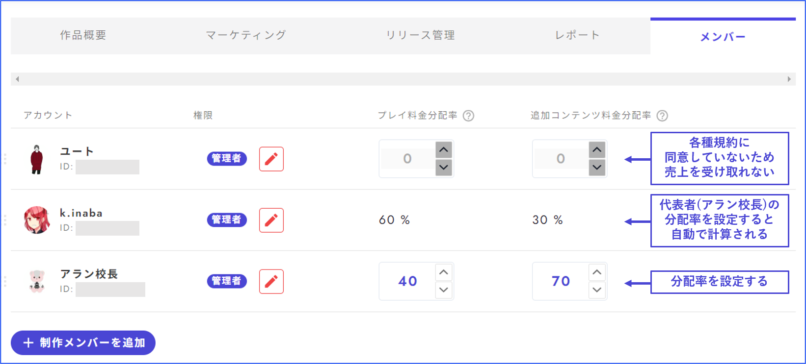

# メンバー

メンバー管理画面では、共同制作者・閲覧者の追加や売り上げの分配率の設定ができます。

<figure><figcaption></figcaption></figure>

## メンバー追加

①「制作メンバーを追加」というボタンを押します。

②追加したいメンバーのウズのユーザーIDを入力します。正しく入力できているとアイコンが出てくるので、それをクリックします。

③権限設定をします。

<figure><figcaption></figcaption></figure>

## 作家として表示

アプリ内に作家として表示するための設定は「メンバー」画面ではなく、「作品概要」から行います。

「作品概要」の作家欄に**作家名**（プレイヤー名ではない）を入力し、肩書きを設定してください。アプリ内での表示イメージは右の通りです。

※作家名の確認方法\
作品を制作し、一度でも最新バージョンの作成をしたことがあれば、アプリ内のサイドメニューに「作家ページ」というボタンが現れるようになっています（アプリとウズスタジオへ同じアカウントでログインしている前提）。作家ページボタンを押すと、自分の作家名が確認できます。

<figure><figcaption></figcaption></figure>

## プレイ料金分配率

印税のメンバー内での分配率の設定です。売上を受け取る人が複数いない場合は、ご自身の表記が100%になっている状態から触る必要はありません。

変更すると、次月\*から新しい比率が適用されます。「ウズスタジオ有償公開規約」に未同意のメンバーには分配することができません。[規約への同意](author.md#heno)は制作シナリオ一覧画面の右上のアイコンから行います。

## 追加コンテンツ分配率

追加コンテンツの売上の分配率の設定です。売上を受け取る人が複数いない場合は、ご自身の表記が100%になっている状態から触る必要はありません。

変更すると、次月\*から新しい比率が適用されます。「ウズ追加コンテンツ有償公開規約」に未同意のメンバーには配分を設定することができません。[規約への同意](author.md#heno)は制作シナリオ一覧画面の右上のアイコンから行います。

#### \*次月から の解釈について

ウズアナリティクスでは、その月初め～月末までの売上が翌月に集計として表示され、翌月以降に振り込み申請できるようになります。売上の発生している、ある月の間に分配率を設定すると、その月の売上の振り込み申請ができるようになる翌月から分配率が反映されます。

例

* 4/1に有料作品をリリースし、4/2に分配率を設定した → 4月分の売上は5月以降に振り込み申請ができるようになり、4/2に設定した分配率が適用されている。
* 4/1に分配率を設定済みの状態で、4/2に有料作品をリリースした → 4月分の売上は5月以降に振り込み申請ができるようになり、4/1に設定した分配率が適用されている。
* 3/31に分配率を設定済みの状態で、4/1に有料作品をリリースした → 3月はまだリリースされておらず売上がないので関係ない。4月分の売上は5月以降に振り込み申請ができるようになり、3/31に設定した分配率が適用されている。
* 4/1に有料作品をリリースしたが、分配率設定を忘れており、5/1に設定した → 4月分の売上は5月以降に振り込み申請ができるが、4月分の売上には分配率が適用されない（代表者1名に支払われる）。6月以降に振り込み申請できる5月分の売上には分配率が適用される。

すなわち、**リリース前**あるいは**リリースした月の間**に分配率を設定する必要があります。**設定ができていないまま、月をまたいでしまった場合は運営にご連絡いただいても対処ができません**ので、予めご了承ください。

<figure><figcaption></figcaption></figure>

## 規約への同意

規約への同意は制作シナリオ一覧画面の右上のアイコンから行ってください。売り上げを受け取る人全員が規約に同意している必要があります。

<figure><figcaption></figcaption></figure>
