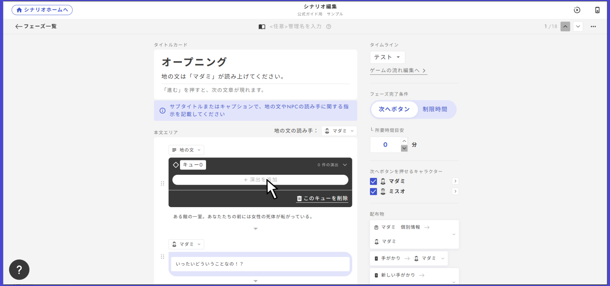

# SE·내레이션

SE·내레이션은 효과음이나 리딩 페이즈의 내레이션 등, 한 번만 재생하는 음성을 재생할 때 사용합니다.

<figure><figcaption></figcaption></figure>

### 재생 조건 설정

SE는 BGM과 달리 한 번만 재생되는 것을 전제로 하므로, 정지 조건은 존재하지 않습니다。

「재생 조건 추가」에서 재생 조건을 설정하면, 그 조건이 충족되었을 때 한 번만 음성이 재생됩니다。

조건은 여러 개 설정할 수 있으며, 해당 조건이 충족될 때마다 재생됩니다。

### 리딩 페이즈에서의 재생 설정

리딩 페이즈 도중에 음성을 재생하고 싶다면, 「큐」 설정을 합니다。

큐는 리딩 페이즈의 각 대사에서 설정할 수 있습니다。

<figure><figcaption></figcaption></figure>

대사에 커서를 올리면 다이아 마크가 나타납니다. 이 다이아 마크를 클릭하면 큐를 생성할 수 있습니다。

<figure><figcaption></figcaption></figure>

검은 바에 큐라고 쓰여 있으면 생성이 완료된 것입니다. 큐 뒤에 붙은 숫자는 큐를 관리하는 번호입니다。

이 큐의 이름은 자유롭게 변경할 수 있습니다. 기억하기 쉬운 이름으로 해도 됩니다。

<figure><figcaption></figcaption></figure>

SE를 추가하고 싶을 때는 이 검은 바를 클릭해 「연출 추가」를 클릭합니다. 그러면 BGM과 SE 중 하나를 선택할 수 있게 됩니다. 이번에는 SE를 추가하려고 하므로 SE를 선택합시다。

<figure><figcaption></figcaption></figure>

선택하면 재생 설정을 할 수 있게 됩니다. 여기에서 재생하고 싶은 음원을 선택하세요。\
또한 특정 조건에서만 SE를 재생하거나, 특정 캐릭터에게만 SE를 재생하는 것도 가능합니다。