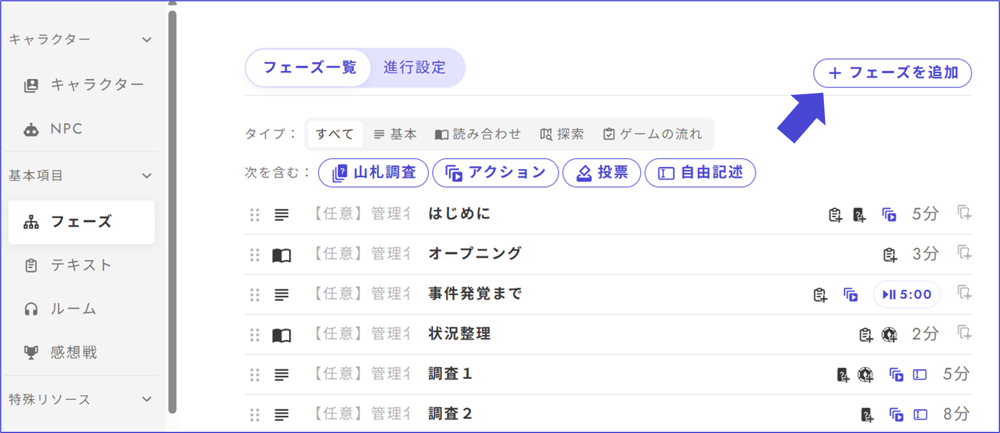

# 단계 생성·개요

단계의 생성 방법에 대해 설명합니다.

먼저 단계 목록 화면의 오른쪽 상단에서 「단계 추가」를 누릅니다. 

<figure><figcaption></figcaption></figure>

그러면 다음과 같은 화면이 표시되므로, 왼쪽 상단의 선택란에서 만들고자 하는 단계의 내용에 맞춰 적절한 것을 선택합니다. 

<figure><figcaption></figcaption></figure>

각 단계 종류의 특징은 아래와 같습니다. 종류명을 클릭하면 보다 자세한 설명 페이지로 이동합니다. 

| 종류명                     | 할 수 있는 것                  | 사용 예                                             |
| ----------------------- | ---------------------- | ----------------------------------------------- |
| [기본](discussion.md)     | 텍스트·이미지·덱·액션·투표 설치 | 캐릭터 텍스트 읽어오기·토론·설명 제시·추가 정보 확인·[투표](select.md) |
| [대본 읽기](script.md)      | 지문·대사의 표시             | 오프닝·엔딩·막간                                |
| [게임의 흐름 표시](timeline.md) | 게임 전체의 흐름과 다음이 어떤 단계인지의 표시  | －                                               |