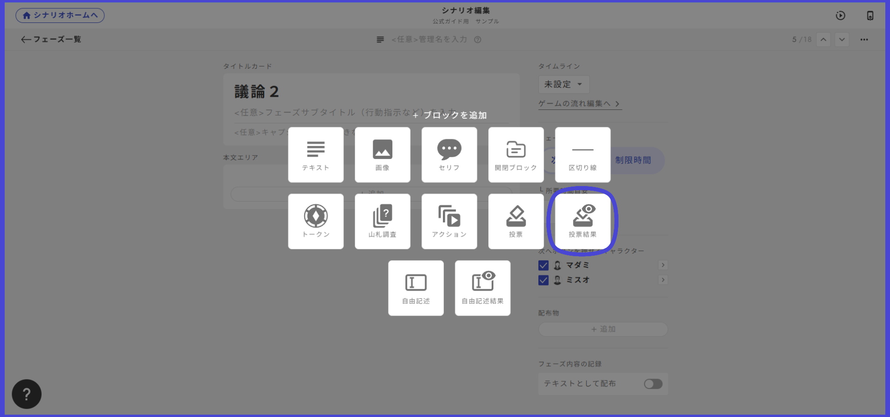
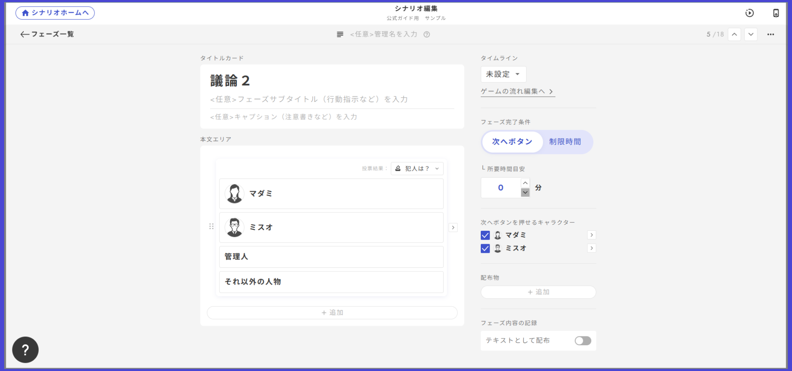
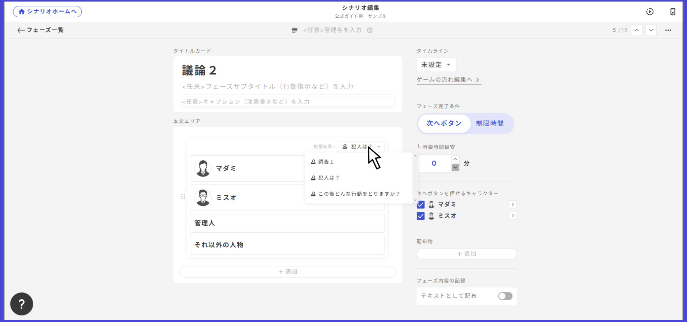

# 투표 페이즈 만드는 방법

투표 페이즈에서는 범인 투표를 비롯한 다양한 투표를 진행할 수 있습니다。&#x20;

원래는 투표 전용의 독립된 페이즈였지만, 2024년 10월 업데이트로 ‘기본’ 페이즈 안에 투표용 박스를 두는 형태로 바뀌었습니다. 투표 페이즈의 기본적인 만들기는 4개의 스텝으로 나뉩니다.

① 페이즈 목록 오른쪽 상단의 ‘페이즈 추가’에서 ‘기본’ 페이즈를 생성

② 페이즈 내의 추가 버튼에서 ‘투표’를 선택

③ 플레이어에게는 보이지 않는 관리명과 선택지를 입력하여 투표 박스를 생성

④ ‘＞’ 버튼으로 상세 편집 화면으로 이동해, 투표 조건·투표할 수 있는 사람·표 수 등의 세부 조건을 설정

<figure><figcaption></figcaption></figure>

투표 박스의 설정 항목과 앱 내에서의 표시 방식에 대해 설명합니다。

## 투표의 선택지

선택지의 이름과 이미지를 설정합니다。 편집 화면으로 이동할 때는 ‘＞’ 버튼을 클릭합니다。

이미지가 있는 경우와 없는 경우의 표시 차이는 아래 샘플과 같습니다。

<figure><figcaption></figcaption></figure>

페이즈 완료 조건에 대해

다음 버튼：투표 대상을 선택하지 않으면 ‘다음’을 누를 수 없는 상태가 됩니다。 투표가 있는 페이즈에서는 이 옵션을 추천합니다。

제한 시간：투표 대상을 선택하지 않았더라도, 설정한 타이머가 0초가 되면 다음으로 진행됩니다。 투표가 있는 페이즈에서 제한 시간을 설정하는 경우에는 주의하세요。

## 투표할 수 있는 캐릭터

해당 투표 페이즈에서 투표할 수 있는 캐릭터를 설정합니다。 여기에서 특정 캐릭터를 설정하면, 그 캐릭터만 투표를 할 수 있습니다。 대표자 한 명에게 투표를 하게 하고 싶을 때 등에 유용합니다。

<figure><figcaption></figcaption></figure>

## 투표를 열람할 수 있는 캐릭터

해당 투표 페이즈의 투표 내용을 열람할 수 있는 캐릭터를 설정합니다。 이 설정을 ON으로 한 캐릭터의 화면에서는 누가 어디에 투표했는지가 아이콘으로 표시됩니다。 중복 투표를 회피하고 싶을 때 유용합니다。

<figure><figcaption></figcaption></figure>

## 투표 결과의 표시 방법

투표 결과란, 특정 투표 페이즈에서 누가 어느 선택지에 투표했고, 각 선택지에 몇 표가 모였는지를 나타내는 화면입니다。

<figure><figcaption></figcaption></figure>

​추가하고 싶은 페이즈의 본문 영역에서 ‘추가’를 선택하고, ‘투표 결과’를 선택합니다。

<figure><figcaption></figcaption></figure>

표시하고 싶은 투표 결과를 변경하려면, 투표의 관리명을 클릭하면 드롭다운이 나타납니다。

<figure><figcaption></figcaption></figure>

여기에서 보여주고 싶은 투표를 선택하면 전환됩니다。

감상전 화면에 표시하고 싶을 때는[여기](../result.md#vote)를 참고하세요。\
\

기본 페이즈, 텍스트 탭, 단서, 감상전에서 투표 결과를 배치할 수 있게 되었습니다。\
※투표가 진행되기 전이라도 상관없이 투표 결과는 표시됩니다。 예를 들어, 투표 결과를 텍스트로 확인시키고 싶어서 처음부터 텍스트 탭이 표시되도록 해두면 투표의 선택지가 사전에 알려져 버리는 일이 발생할 수 있습니다。 그런 경우에는 표시 조건 등을 사용하여 투표 전에 투표 결과가 표시되지 않도록 할 것을 추천합니다。

## 투표의 선택지각 선택지에 「표시 조건」과 「선택 조건」을 설정할 수 있습니다。

「표시 조건」은 특정 조건을 만족했을 때만 그 선택지가 나타나도록 하는 설정입니다。조건을 만족하지 않을 때는 모든 캐릭터의 화면에서 완전히 표시되지 않는 것이 특징입니다。어떤 페이즈에 도달했을 때, 특정 단서를 가지고 있을 때와 같은 조건과 잘 맞습니다。

<figure><figcaption></figcaption></figure>

「투표 조건」은 특정 조건을 만족했을 때나 특정 캐릭터만 해당 선택지에 투표할 수 있도록 하는 설정입니다。투표할 수 없는 선택지는 옅은 색으로 표시됩니다。

<figure><figcaption></figcaption></figure>

같은 선택지에 2명 이상이 투표하지 못하도록 설정할 수도 있습니다。주로, 투표와 단서를 조합해 조사 페이즈를 만들고 싶어 하는 분들을 위한 기능입니다。조사 페이즈의 작성에 대해 더 자세히 알고 싶다면、[이 페이지](../../../../advanced/investigation.md)를 참조해 주세요。

<figure><figcaption></figcaption></figure>

## 복수 표 설정

한 사람에게 복수의 표를 주거나, 조건을 만족한 사람에게만 복수 표를 주는 등의 설정도 가능합니다。

<figure><figcaption></figcaption></figure>

## 페이즈 전체 편집

투표 박스 이외의 부분에는 기본 페이즈에서 배치할 수 있는 텍스트·이미지·대사·덱·액션 등을 무엇이든 배치할 수 있습니다。

또한 다른 설치물과 마찬가지로, 투표 박스 자체에도 표시 조건을 걸 수 있습니다。아래 예에서는 캐릭터 1에게만 보이는 투표 박스를 설치하고 있습니다。

<figure><figcaption></figcaption></figure>

## 2개 이상의 투표를 설치할 때

하나의 페이즈 내에 2개 이상의 투표를 설치할 때에는 각각 무엇에 대한 투표인지 텍스트로 적는 것을 잊지 마세요。

<figure><figcaption></figcaption></figure>