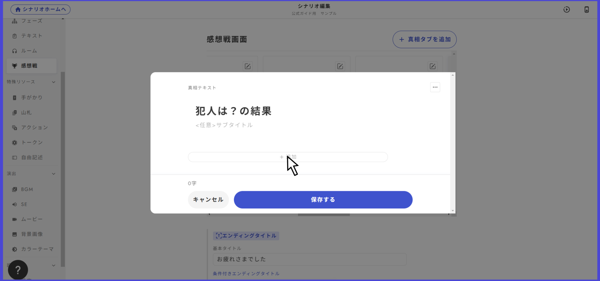

# 감상전 화면

감상전 화면이란, 토론·투표·엔딩 등 모든 것이 끝난 후에 표시되는 해설·결과 화면입니다.

<figure><figcaption></figcaption></figure>

## 탭의 내용

탭에 입력할 수 있는 내용은 「제목」「설명」「본문」의 3가지입니다。

탭 내용은 각각의 탭 오른쪽 위를 클릭하면 편집할 수 있습니다。

<figure><figcaption></figcaption></figure>

앱 화면과의 대응은 다음과 같습니다。

<figure><figcaption></figcaption></figure>

## 제목의 조건부 표시

감상전 화면에서 가장 처음 표시되는 제목을 조건에 따라 다르게 표시할 수 있습니다。

기본적으로 「기본 제목」 부분만 작성해두면 문제가 없지만, 「조건부 엔딩 제목을 추가」를 누르면 복잡한 분기를 설정할 수 있습니다。

<figure><figcaption></figcaption></figure>

### 탭의 순서 바꾸기

탭을 길게 눌러 다른 탭과 표시 순서를 바꿀 수 있습니다。

### 투표 결과를 표시 

투표 기능은 범인 투표뿐만 아니라 조사나 개별 목표의 달성 판정 등 다양한 장면에서 이용할 수 있으며, 시나리오 내에서 마련한 투표 중 감상전 화면에서 결과를 표시할 것을 선택할 수 있습니다。

<figure><figcaption></figcaption></figure>

투표를 추가하고 싶은 진상 탭을 열고, 추가를 클릭합니다。

<figure><figcaption></figcaption></figure>

투표 결과를 선택하면, 플레이어가 투표 결과를 열람할 수 있게 됩니다。

### 미획득 단서 목록을 표시

탭 목록의 맨 오른쪽에 있는 「미획득 단서 목록」이라는 탭의 토글을 켜면, 감상전 탭 목록의 마지막에 그 이벤트에서 누구에게도 획득되지 않았던 단서의 목록이 표시됩니다。

<figure><figcaption></figcaption></figure>