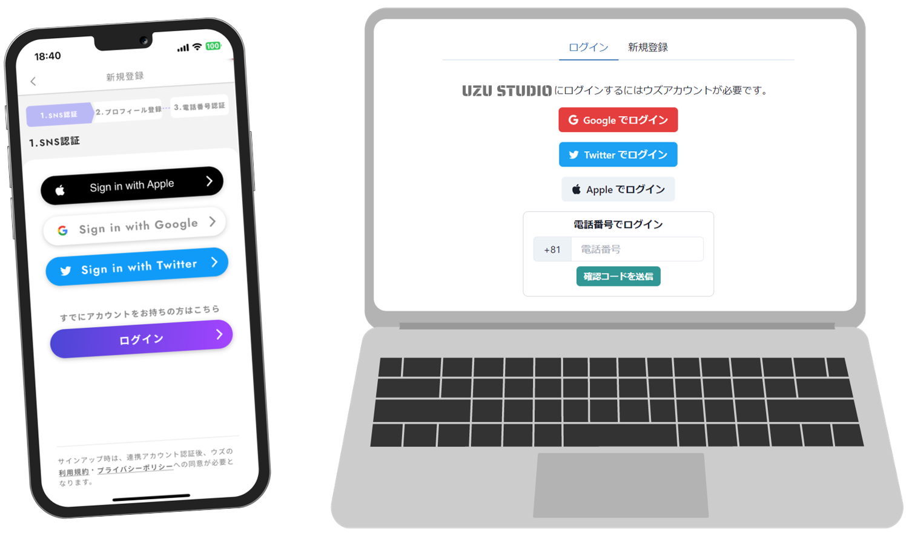

# 로그인 방법

[앱 「우즈」](https://uzu.one/app/dl)에서 계정을 만든 뒤, 같은 계정으로 우즈스튜디오에 로그인합니다. 우즈 계정이 없다면 먼저 우즈를 다운로드해 계정을 만들어 주세요.

「우즈」에 전화번호를 등록한 분이 많을 것으로 예상되므로, 「**전화번호로 로그인**」을 추천합니다.

우즈스튜디오에는 [여기](https://studio.uzu-app.com/)에서 접속할 수 있습니다. 북마크해 두면 편리합니다.\
이용 인증에는 **Discord 계정**이 필요하므로, 계정이 없다면 함께 만들어 주세요.

우즈 계정에 외부 서비스를 연동해 둔 경우에는 해당 방식으로도 로그인할 수 있습니다.

<figure><figcaption></figcaption></figure>
