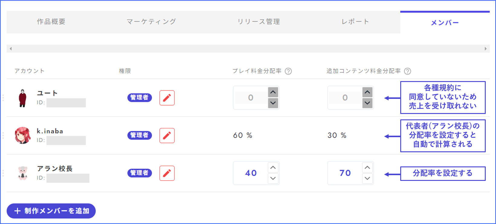

# 멤버

멤버 관리 화면에서는 공동 제작자·열람자 추가와 매출 분배율 설정을 할 수 있습니다. 

<figure><figcaption></figcaption></figure>

## 멤버 추가

① '제작 멤버를 추가' 버튼을 누릅니다. 

② 추가하려는 멤버의 우즈 사용자 ID를 입력합니다. 올바르게 입력되면 아이콘이 표시되므로 그것을 클릭합니다. 

③ 권한을 설정합니다. 

<figure><figcaption></figcaption></figure>

## 작가로 표시

앱 내에서 작가로 표시하기 위한 설정은 '멤버' 화면이 아니라 '작품 개요'에서 진행합니다. 

‘작품 개요’의 작가란에**작가명**(플레이어 이름이 아님)을 입력하고, 직함을 설정해 주세요. 앱 내에서의 표시 예시는 오른쪽과 같습니다. 

※ 작가명 확인 방법\
우즈 스튜디오에 로그인되어 있고 작가 프로필 편집을 완료했다면, 앱 내 사이드 메뉴에 '작가 페이지'라는 버튼이 나타납니다（앱과 우즈 스튜디오에 동일한 계정으로 로그인되어 있다는 전제）. '작가 페이지' 버튼을 누르면 자신의 작가명을 확인할 수 있습니다. 

<figure><figcaption></figcaption></figure>

## 플레이 이용료 분배율

인세를 멤버 간에 분배하는 비율 설정입니다. 매출을 받을 사람이 복수로 없으면, 본인의 표기가 100%로 되어 있는 상태에서 건드릴 필요가 없습니다. 

변경하면, 다음 달\*부터 새로운 비율이 적용됩니다. 「우즈 스튜디오 유상 공개 규약」에 미동의한 멤버에게는 분배할 수 없습니다. [규약에 동의](author.md#heno)는 제작 시나리오 목록 화면의 오른쪽 상단 아이콘에서 진행합니다. 

## 추가 콘텐츠 분배율

추가 콘텐츠 매출의 분배 비율 설정입니다. 매출을 받을 사람이 복수로 없으면, 본인의 표기가 100%로 되어 있는 상태에서 건드릴 필요가 없습니다. 

변경하면, 다음 달\*부터 새로운 비율이 적용됩니다. 「우즈 추가 콘텐츠 유상 공개 규약」에 미동의한 멤버에는 배분을 설정할 수 없습니다. [규약에 동의](author.md#heno)는 제작 시나리오 목록 화면의 오른쪽 상단 아이콘에서 진행합니다. 

#### \*다음 달부터의 해석에 대하여

우즈 애널리틱스에서는 그 달 초부터 말까지의 매출이 익월에 집계로 표시되며, 익월 이후에 입금 신청을 할 수 있게 됩니다. 매출이 발생하고 있는 어떤 달 동안에 분배율을 설정하면, 그 달의 매출에 대한 입금 신청이 가능해지는 익월부터 분배율이 반영됩니다. 

예

* 4/1에 유료 작품을 릴리스하고 4/2에 분배율을 설정했다 → 4월분 매출은 5월 이후에 입금 신청이 가능해지며, 4/2에 설정한 분배율이 적용된다. 
* 4/1에 분배율을 미리 설정한 상태에서 4/2에 유료 작품을 릴리스했다 → 4월분 매출은 5월 이후에 입금 신청이 가능해지며, 4/1에 설정한 분배율이 적용된다. 
* 3/31에 분배율을 미리 설정한 상태에서 4/1에 유료 작품을 릴리스했다 → 3월은 아직 릴리스되지 않아 매출이 없으므로 관련 없다. 4월분 매출은 5월 이후에 입금 신청이 가능해지며, 3/31에 설정한 분배율이 적용된다. 
* 4/1에 유료 작품을 릴리스했지만 분배율 설정을 잊어 5/1에 설정했다 → 4월분 매출은 5월 이후에 입금 신청이 가능하지만, 4월분 매출에는 분배율이 적용되지 않는다（대표자 1명에게 지급됨）. 6월 이후에 입금 신청 가능한 5월분 매출에는 분배율이 적용된다. 

즉,**릴리스 전** 또는 **릴리스한 달 동안** 분배율을 설정해야 합니다. **설정을 하지 않은 채로 달이 넘어가 버린 경우에는 운영에 연락하셔도 대응할 수 없습니다**. 미리 양해 부탁드립니다. 

<figure><figcaption></figcaption></figure>

## 규약에 동의

규약에 대한 동의는 제작 시나리오 목록 화면 오른쪽 상단의 아이콘에서 진행해 주세요. 매출을 받는 모든 사람이 규약에 동의해야 합니다. <figure><figcaption></figcaption></figure>