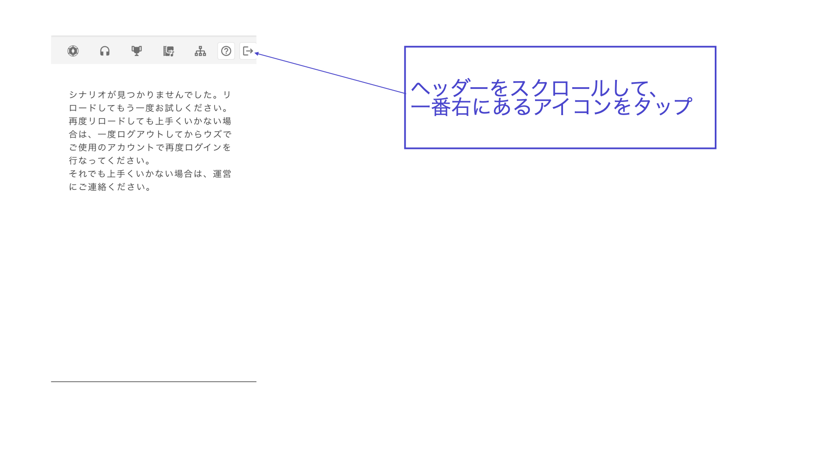

# 常見問題

## 關於角色

PC和NPC最多可以創建多少人

PC（玩家角色）最多可以創建7人。\
NPC理論上是無限的。

設定的任務在遊戲中可以從哪裡確認

在UZU STUDIO的角色編輯畫面中設定的任務，**僅在感想戰畫面**中顯示。在遊戲中的文本標籤等不會自動顯示，因此如果想向玩家提示任務，請**在分發的文本中作為文字信息載入**。

\\

## 關於階段 

為什麼在有分支的情況下，無法將所有設置為條件遷移（藍色線的分支）？

如果條件遷移未能涵蓋所有可能性，則可能會出現玩家的選擇導致無法到達的階段，從而導致**無法進行**。為了防止出現這種情況，必須至少有一個對應於「條件遷移未設置的其餘所有」的**基本遷移**（黑色線的分支）。

是否可以在同票和非同票時分開分支？

可以設置條件為將同票視為最多的「**同票最多**」，以及僅在單獨領先時視為最多的「**單獨最多**」。

例如，在四人劇本中，即使是2對2，只要有兩人投票給犯人，就希望轉移到正確結局的情況下，使用「**同票最多**」；而只想在2：1：1或3：1犯人最多的情況下才認可，則使用「**單獨最多**」會更好。

是否可以在閱讀階段插入圖片

點擊台詞框旁邊的六個點的標記，選擇「轉換為圖片」，即可插入圖片。

\\

## 關於文本

希望分發在特定階段後無法重讀的文本

請在文本的分發條件中設置「僅在特定階段中」。

移動到其他畫面後返回，輸入的文本消失了

可能只是反映延遲，請嘗試重新加載「Ctrl + R」「Command + R」。

除了數字外的內容無法變為斜體

在編輯器畫面中不會反映斜體。在動作確認或應用上會反映。

更改了文字顏色但未反映

如果將原本不是黑色的文字顏色用其他顏色覆蓋，則不會立即在編輯器畫面中反映。請嘗試重新加載「Ctrl + R」「Command + R」，即可反映。

無法上傳圖片

超過4.5MB的圖片無法上傳。請壓縮大小後再上傳。\
即使小於4.5MB但看似無法上傳，請嘗試重新加載「Ctrl + R」「Command + R」。\
如果仍然無法反映，請聯繫運營團隊。

在動作確認或測試遊玩中顯示「發生錯誤」

如圖片所示的錯誤，原因是有未填寫內容的文本框。從UZU STUDIO的編輯器畫面中刪除相應的文本框，下一次動作確認（測試遊玩）即可修復。

\\

## 關於線索

是否可以根據查看的人更改某一線索的顯示內容

可以。[請參考此頁面](advanced/text-customize.md)。

希望在特定時間點後隱藏已分發的線索

請使用[線索回收](basic-features/clue.md#hui-shou-tiao-jian-ren-yi)功能。

\\

## 關於房間

尚無問題。

\\

## 關於感想戰畫面

不知道在感想戰畫面應該寫什麼

在需要推理的劇本中，請務必添加一個揭示真相及其解說的標籤。作為解說，不知道應該寫什麼內容的人，請參考官方Discord伺服器內的「編輯部文章」頻道中的「解說文本的寫法與技巧」文章。

在感想戰畫面放置的連結點擊/點擊後無反應

在應用的實際畫面上點擊連結時，可能會出現正常跳轉/無法跳轉/應用崩潰等情況，因為根據設備和環境動作不同，因此無法新設置連結。僅顯示URL字串或設置二維碼圖片是可能的。

關於過去設置的連結\
在動作確認中設置為點擊無反應。

\\

## 關於演出 

想在階段中途切換BGM

如果是閱讀階段則可以。[演出](basic-features/bgm.md)中說明了方法，請參考。

有無法上傳的BGM

超過每分鐘2MB的BGM無法上傳。搜索「mp3 壓縮」等，可以找到可以縮小容量的網站，請將其縮小到每分鐘2MB以下後再上傳。

BGM的音量太大

請使用Audacity等應用或可以調整音量的網站進行音量調整後上傳，或使用UZU STUDIO內的音量調整按鈕進行調整。

實際在應用內聽到的音量，可以通過在智能手機上訪問UZU STUDIO→戴上耳機播放BGM來確認。

\\

## 關於遊戲流程

在階段中設置的限制時間與遊戲流程中顯示的時間不同

除了在階段編輯畫面中設置的計時器外，還需要在[遊戲流程](QandA.md#gmunorenitsuite)的編輯畫面中輸入限制時間。將階段編輯畫面中設置的限制時間輸入到遊戲流程的編輯畫面中即可解決不一致。

\\

## 其他

顯示「找不到劇本〜」

自製劇本卻顯示「找不到劇本〜」的情況下的對策。

**從V1遷移的劇本**

如果要在v2的UZU STUDIO中使用v1劇本，需要進行遷移處理。

請進行[v1-to-v2.md](others/v1-to-v2.md "mention")。

**V2劇本**

可能是未正常登錄，請進行以下操作。

**①從「找不到劇本〜」的畫面中登出**

PC上訪問UZU STUDIO。
スしている方は左下のログアウトボタン、スマートフォンの方はヘッダー一番右のドアアイコンのボタンからログアウトを行います。

* PC的用戶

* 智能手機的用戶

**②將轉移到登錄畫面，請使用您平常使用的UZU帳戶的登錄方式登錄**

即使使用此方法重新登錄仍出現相同症狀的用戶，請聯繫運營。

出現「此帳戶未與UZU連接」的畫面

請點擊畫面上顯示的登出並再次登錄。如果重新登錄無法解決，請聯繫運營團隊。

看起來場景的內容消失了

這通常是因為加載時間不夠。請重新加載「Ctrl + R」「Command + R」，或者稍後再確認。如果無法解決，請聯繫運營團隊。

顯示Application error

這可能是因為連續進行多個操作，導致加載時間不夠。請重新加載「Ctrl + R」「Command + R」，或者稍後再確認。如果無法解決，請聯繫運營團隊。

動作確認或應用反映錯誤顯示「undefined的階段」

這需要我們這邊進行處理，請聯繫運營團隊。

動作確認時，設置為從第一階段播放的音頻無法播放

在Google Chrome中，設置為從第一階段播放的音頻無法播放。在應用端可以正常播放。作為對策，請嘗試以下兩種方法之一。\
1\. 使用其他瀏覽器（如Safari）\
2\. 修改Google Chrome的autoPlay政策設置。\\

autoPlay政策設置的修改方法如下。\\

1. 點擊動作確認畫面的URL欄上的鎖定標誌 → 點擊「網站設置」\
   \\
2. 在「音頻」項目中點擊「自動（默認）」→ 更改為「允許」\
   \\

如何添加共同編輯者？

從場景主頁面的「[成員](scenariohome/author.md)」進行。點擊添加，輸入共同編輯者的**UZU用戶ID**。

應用「UZU」的側邊菜單中未顯示「作家頁面」

登錄UZU STUDIO後，創建一個或多個場景後將顯示。

詳情請參閱[這裡](top/profile.md#pjibotan)。

無法訪問此網站/顯示ERR_CONNECTIN_CLOSED

這通常是由於您使用的Wi-Fi的臨時安全限制所致。有報告稱經過一天以上會改善。

如果您著急，應該可以通過智能手機的共享網絡或智能手機4G/5G訪問。

