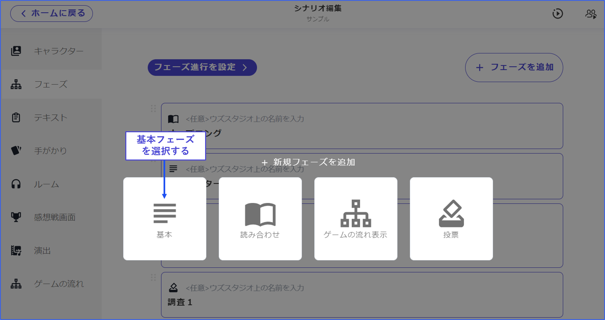

# 想要分發所有結局

在v1中，所有結局在感想戰中被強制開示，但在v2中，作者可以設定是否顯示未通過的結局。

以下說明如何在感想戰畫面中確認所有結局的方法。

\

## 方法1：在「辛苦了」畫面中分發

**①新增「辛苦了」階段**

從階段列表畫面中點擊「新增階段」，選擇「基本」階段來創建即可。

階段的內容可以自由設定。

\

**②將「辛苦了」階段設置在感想戰畫面前一個**

從階段列表畫面中進入「設定階段進行」，將①中新增的階段插入到「感想戰畫面」的前一個。

\

**③將結局也分發為文本**

從階段列表中進入每個結局階段的編輯畫面，勾選「階段內容的記錄」中的「作為文本分發」。

<figure><figcaption></figcaption></figure>

**④更改分發的時機**

從文本列表中進入③中新增的每個結局文本的編輯畫面，將分發的階段更改為「辛苦了」。

<figure><figcaption></figcaption></figure>

\

## 方法2：或者在設定中分發

**①將結局也分發為文本**

從階段列表中進入每個結局階段的編輯畫面，勾選「階段內容的記錄」中的「作為文本分發」。

<figure><figcaption></figcaption></figure>

\

**②新增分發的時機**

將條件更改為「〇〇結束時」，並將其他所有結局作為分發的時機新增。

條件之間的關係設為「或者」。

<figure><figcaption></figcaption></figure>

\

## 方法3：轉記到感想戰畫面

**①在感想戰畫面中新增「其他結局」等標籤**

**②在標籤內轉記結局**

<figure><figcaption></figcaption></figure>
