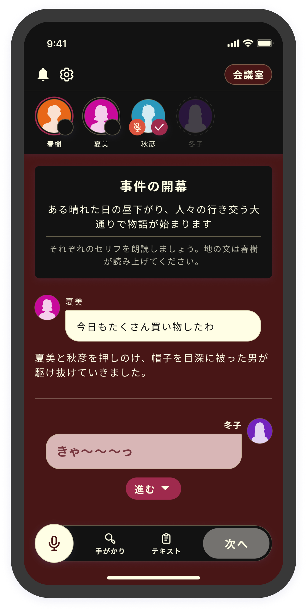

# 顏色主題

可以從顏色主題頁面設定顏色主題。

<figure><figcaption></figcaption></figure>

<figure><figcaption></figcaption></figure>

截至2024/01/12，目前可以使用以下類型的主題。

<table data-view="cards"><thead><tr><th></th><th></th><th></th></tr></thead><tbody><tr><td><strong>亮色</strong></td><td></td><td></td></tr><tr><td><strong>暗色</strong></td><td></td><td></td></tr><tr><td><strong>海洋</strong></td><td></td><td></td></tr><tr><td><strong>古典</strong></td><td></td><td></td></tr><tr><td><strong>夢幻</strong></td><td></td><td></td></tr><tr><td><strong>現代</strong></td><td></td><td></td></tr><tr><td><strong>機械</strong></td><td></td><td></td></tr><tr><td><strong>懷舊</strong></td><td></td><td></td></tr><tr><td><strong>賽博朋克</strong></td><td></td><td></td></tr></tbody></table>

未來計劃實現能在場景中切換顏色主題的功能。

文字顏色會自動優化，因此不需要根據模式進行更改。

