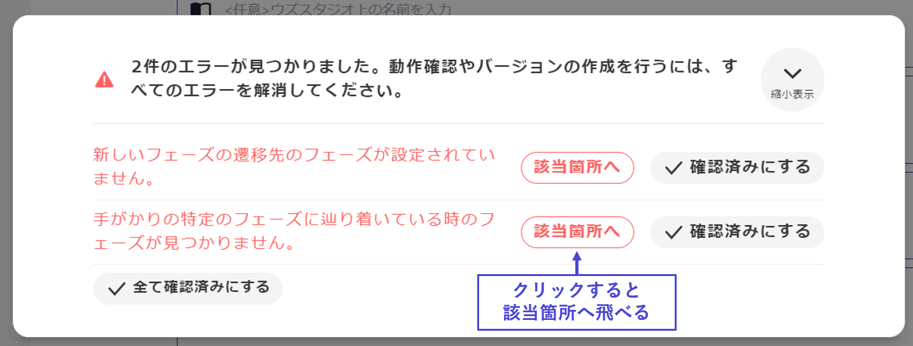

# 右上按鈕：創建最新版本

## 創建最新版本的操作

完成劇本製作後，首先將製作的內容反映到應用程式中並進行測試遊玩。為此，需要遵循創建版本的步驟。

按下**右上角的按鈕**，將自動進行錯誤檢查，以確認是否可以創建新版本。

## 錯誤檢查和修正

如果有設置遺漏，將會顯示**未設置部分**，請適當修正。

點擊「**前往該處**」，可以直接跳轉到出錯的位置。

\

如果所有設置均無問題，將彈出創建版本的彈窗。

輸入欄是為了方便之後確認所修正內容的個人備忘欄。只有作者能看到，因此可以自由填寫。此外，即使留空也沒有問題。

#### ※什麼是最新版本？

這是僅供作者創建事件的測試遊玩版本，應用程式上的一般用戶無法遊玩的版本。

在v2中，與v1相比，自由度提高了，因此設置部分和需要考慮的部分增多，可能更容易發生實施錯誤。為了避免錯誤遺留的版本被公開，會先創建最新版本。最新版本在發佈管理畫面中顯示為「最新版」。

從發佈管理畫面按下「**發佈最新版**」，即會作為一般用戶也能遊玩的版本在應用程式上發佈。v1→v2移行作品在**移行申請獲得批准前無法按下「發佈最新版」**。

關於管理版本的「發佈管理」畫面，請參閱[這裡](../scenariohome/release.md)的說明。