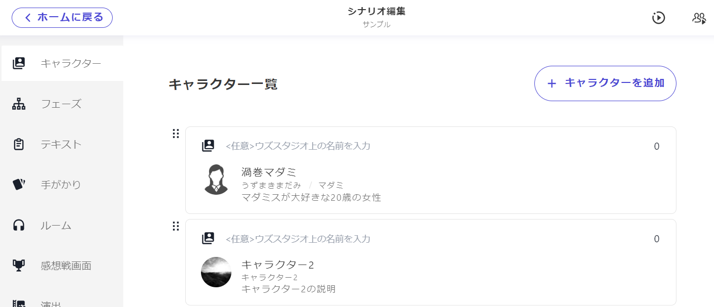

# 角色的基本項目

## 角色的基本項目

說明角色基本信息的設定。

<figure><figcaption></figcaption></figure>

\\

### 基本項目

從角色列表中點擊**想要編輯的角色**，將進入角色信息的設定畫面。

玩家角色的基本項目如下所示。圖標和暱稱可以根據條件進行更改（※後述）。

| 項目       | 內容                   | 在UZU STUDIO應用中顯示的位置     |
| -------- | -------------------- | ----------------------- |
| 正式名稱(必須) | 全名等                  | 劇情詳細畫面・遊玩中畫面的登場人物介紹     |
| 讀音(可選)　　 | 正式名稱的讀音              | 遊玩中畫面的登場人物介紹            |
| 說明文(必須)  | 角色的介紹文               | 劇情詳細畫面・遊玩中畫面的登場人物介紹     |
| 圖標(必須)   | 角色圖片                 | 登場人物介紹和讀劇本時的圖標          |
| 暱稱(必須)   | 僅姓氏・僅名字等希望在遊玩中被稱呼的名稱 | 遊玩中畫面上方角色圖標下方・讀劇本時的顯示名稱 |

<figure><figcaption></figcaption></figure>

<figure><figcaption></figcaption></figure>

### PC・NPC的新增

角色的新增從列表畫面右上「新增角色」進行。新增時選擇是**玩家角色**還是**NPC**。若為NPC，可在角色個別的編輯畫面中選擇「是否在遊玩中的登場人物介紹中顯示」。\\

顯示的角色範例

* 受害者
* 劇情中重要的NPC\\

不顯示的角色範例

* 僅部分角色知道存在的NPC
* 僅在讀劇本時登場的「刑警」等NPC

\\

### 角色的刪除

當**想要刪除**角色時，請按角色個別編輯畫面右上角的「・・・」。

從「・・・」按鈕除了刪除外，還可以進行「**變更為NPC**」「**角色的複製**」。

\\

### 結尾卡

可以為每個玩家角色設定結尾卡。

建議尺寸為「橫16：縱9」。

### 圖標・暱稱的條件設定

遊玩中畫面上方和讀劇本時顯示的圖標・暱稱可以根據條件進行更改。

例如在圖片的例子中，當結局1開始時，將揭示該角色是「怪盜UZU」。

<figure><figcaption></figcaption></figure>
