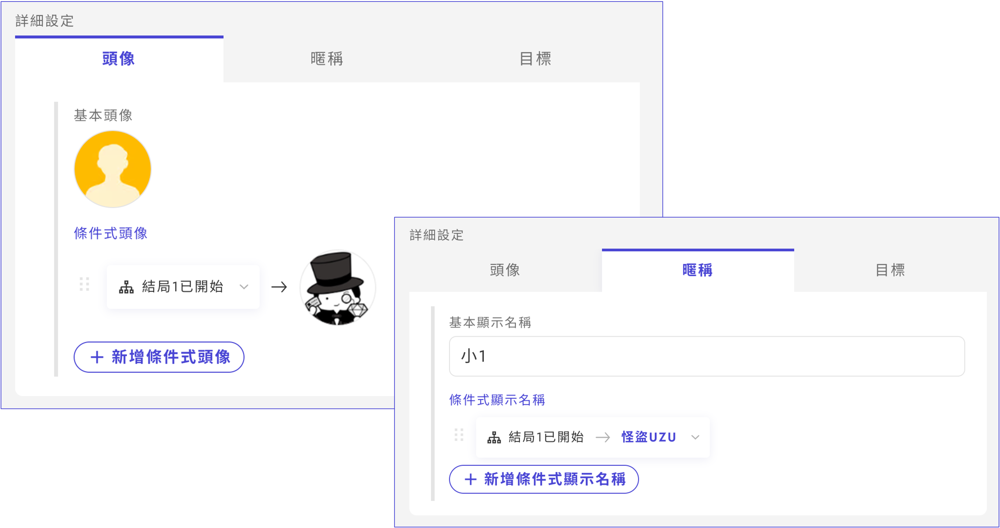

# 角色的基本項目

<figure><figcaption></figcaption></figure>

\\

### 基本項目

從角色列表中點擊**想要編輯的角色**，將進入角色資訊的設定畫面。

玩家角色的基本項目如下所示。圖標和暱稱可以根據條件進行更改（※[後述](basic.md#tu-biao-ni-cheng-de-tiao-jian-she-ding)）。

| 項目       | 內容                    | 在UZU APP中顯示的位置          |
| -------- | --------------------- | ----------------------- |
| 正式名稱(必須) | 全名等                   | 劇情詳細畫面・遊玩畫面的登場人物介紹      |
| 說明文(必須)  | 角色介紹                  | 劇情詳細畫面・遊玩畫面的登場人物介紹      |
| 圖標(必須)   | 角色圖片                  | 登場人物介紹和劇情階段的圖標          |
| 暱稱(必須)   | 僅姓氏・僅名字等，希望在遊玩中被稱呼的名稱 | 遊玩中畫面上方角色圖標下方・劇情階段的顯示名稱 |

<figure><figcaption></figcaption></figure>

<figure><figcaption></figcaption></figure>

### 角色・NPC的新增

角色和ＮPC的新增透過各自列表畫面右上「新增」按鈕進行。若為NPC，可在角色個別的編輯畫面中選擇「是否在遊玩中的角色列表中顯示」。

顯示的角色範例

* 受害者
* 劇情中重要的NPC

不顯示的角色範例

* 僅部分角色知道存在的NPC
* 僅在某劇情階段登場的「刑警」等NPC

\\

### 角色的刪除

當**想要刪除**角色時，請按角色個別編輯畫面右上角的「・・・」。

從「・・・」除了可以刪除外，還可以進行「**轉換為NPC**」與「**角色的複製**」。

\\

### 紀念卡

可以為每個玩家角色設定紀念卡。

建議尺寸為「橫16：縱9」。

### 圖標・暱稱的條件設定

遊玩中畫面上方和讀劇本時顯示的圖標・暱稱可以根據條件進行更改。

例如下圖的範例中，當結局1開始時，將揭示該角色是「怪盜UZU」。

<figure><figcaption></figcaption></figure>
