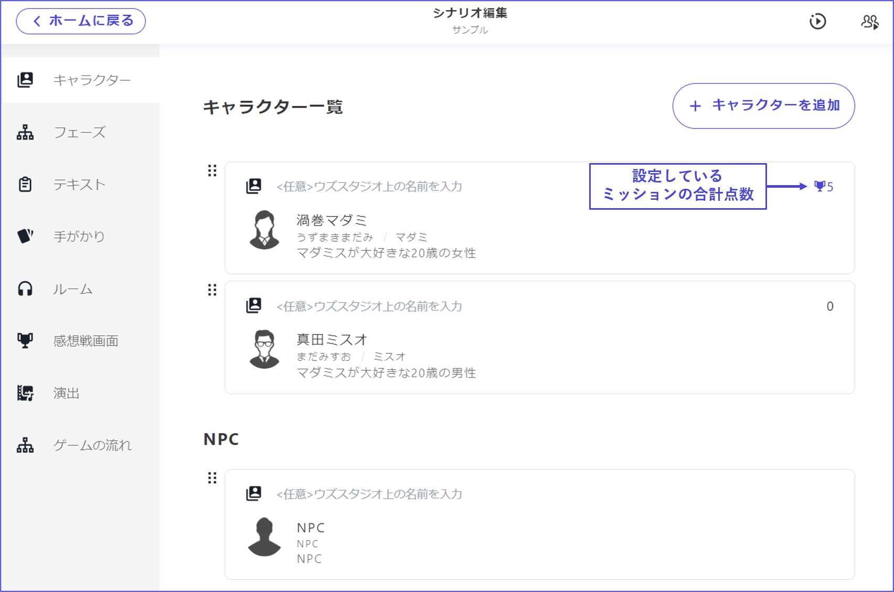

# 任務

在UZU STUDIO v2中，可以為每個角色設定自動判定的**任務**。

如果想要設定任務，首先從「＋」按鈕新增任務標籤。

在「標題」中填寫「任務內容」。 「達成條件」可以自由設定。

例子

* 推理任務的情況：當某個角色投票給某個**選項**（犯人）時
* 收集任務的情況：當某個角色擁有某個**線索**時
* 涉及選擇的任務的情況：當到達某個**結局**時

設定的任務**僅在感想戰畫面中**顯示。各角色的**文本標籤等不會自動分發任務內容**，因此在遊戲過程中揭示的任務也可以同樣設定，沒有問題。

反過來說，如果不在分發文本中以文字形式寫下任務內容，玩家將無法得知，請注意。

任務可以分配**分數**。**分數的總和**會顯示在角色列表畫面中，可以確認與其他角色的平衡。

分數分配為0分的任務，將作為達成/未達成，在感想戰畫面中不顯示分數標記。

