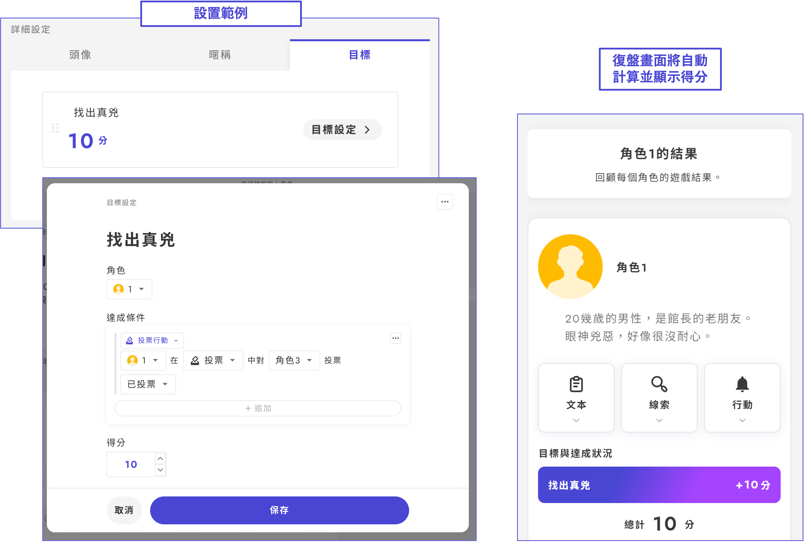

# 目標

在UZU STUDIO v2中，可以為每個角色設定自動判定的**目標**。

如果想要設定目標，首先從「＋」按鈕新增目標標籤。

在「標題」中填寫「目標內容」。&#x20;

「達成條件」可以自由設定。

範例

* 推理目標：當某個角色投票給某個**選項**（犯人）時
* 收集目標：當某個角色擁有某個**線索**時
* 涉及選擇的目標：當到達某個**結局**時

設定的目標**僅在感想戰畫面中**顯示。各角色的文本等**不會自動分發目標內容**，因此在遊戲途中才會揭示的目標也可以以相同方式進行設定。

反之，如果不在文本中以文字形式寫下目標內容，玩家將無法得知，請注意。

分數分配為0分的目標，不論達成/未達成，在感想戰畫面中不顯示分數標記。
