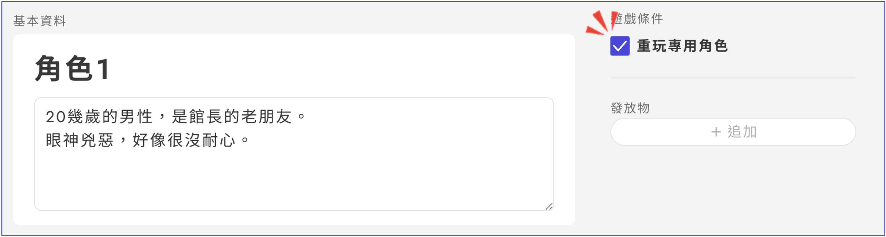

# 重玩專用角色

2024年5月推出了周回遊玩功能，現在可以設定周回遊玩角色。

在UZU STUDIO的設定非常簡單。

只需在角色編輯畫面的右上角勾選「重玩專用角色」。

<figure><figcaption></figcaption></figure>

## 重玩功能的詳細資訊

* 勾選了「重玩專用角色」的角色，只有已經用該角色以外的角色玩過該劇本的人，或在劇本詳細畫面中將未玩按鈕變更為已玩的人才能選擇。
* 已經玩過一次設定有重玩專用角色的劇本的人，在第二次及以後的遊玩中，只能選擇重玩專用角色。
* 可以根據周回遊玩角色和普通角色來變更遊玩費用。在進行公開準備時的表單中有回答欄，請在那裡指定。
* 如果將GM或推進劇情角色設定為重玩專用角色，並希望事前分發給該角色某些資料，請使用「[追加內容](../../scenariohome/marketing.md#kontentsuno)」。當將劇本詳細畫面的未玩按鈕變更為已玩時，追加內容可以在遊玩前進行查看。
