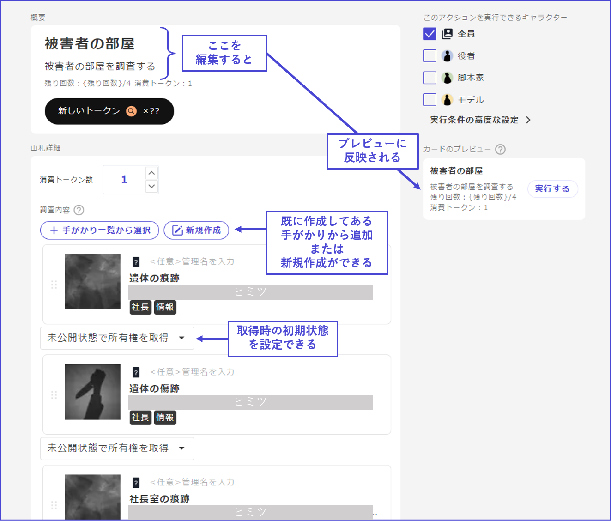
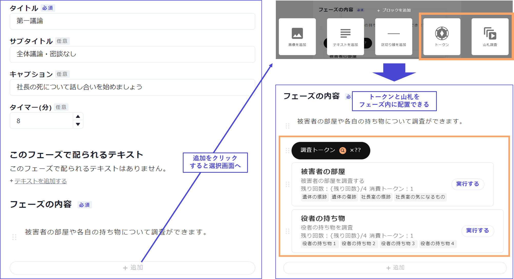

```markdown
# 山札

在山札中，可以消耗任意的代幣來獲取線索。

## 代幣・山札的創建

由於在山札中消耗代幣來獲取線索是前提，因此在首次創建山札時，需要先進行**代幣**的設定。點擊「前往代幣設定」會跳轉到代幣設定畫面。

<figure><figcaption></figcaption></figure>

\\

如果代幣尚未設定，畫面會顯示如下，請點擊「創建代幣」。

<figure><figcaption></figcaption></figure>

\\

設定代幣名稱、代幣的外觀、分發條件。如果調查需要花費金錢的印象，可以設定為硬幣；如果需要花費時間的印象，可以設定為沙漏。

也可以根據用途設定多個代幣。

<figure><figcaption></figcaption></figure>

\\

如果是**均等分發給所有人**的普通調查代幣，則可以在達到某個階段時分發固定數量。

也可以設定在獲取某個線索或在某個選項中投票時，滿足特殊條件時分發的代幣。


\\

代幣設定完成後，從左側菜單返回「山札」。

可以通過「添加山札」按鈕創建新的山札。

<figure><figcaption></figcaption></figure>

\\

## 山札的編輯

山札的基本項目如下：

* **標題**
  * 山札的標題。
* **說明文**
  * 山札的說明文。使用山札時的按鈕固定為「**執行**」，請撰寫符合執行這一詞的說明文。
  * 山札的剩餘張數和消耗代幣會自動顯示，因此不需要包含在說明文中。
* **執行條件**
  * 可以設定山札的執行條件。例如，可以設定特定角色無法執行，或必須擁有特定線索才能執行。
* **消耗代幣**
  * 可以設定抽取山札時消耗多少代幣。
  * 不是按線索，而是按山札固定。
* **包含在山札中的線索**
  * 可以設定包含在山札中的線索。可以設定任意數量。
  * **已經創建線索**的情況下，請選擇「從線索列表中選擇」；**新創建線索**的情況下，請點擊「新建」。
  * 對於每個線索，可以設定當從山札中抽取線索時，是否讓抽取線索的角色擁有所有權，或者是公開給所有人等幾種設定。擁有所有權的人可以在任意時刻進行公開、共享或轉讓。
  * 包含在山札中的線索，其分發條件自動設定為「從山札中抽取時」，因此不需要**每個線索的分發條件設定**。




\\

山札的刪除有兩種方法。

如果要**保留山札中的線索僅解除山札結構**，請選擇「刪除此山札」；如果要**刪除山札及其包含的所有線索**，請選擇「連同線索一起刪除此山札」。


\\

## 設置山札

山札可以設置在「**基本**」階段。基本階段可以通過圖標辨識。

從階段列表中選擇要設置山札的階段。


\\

點擊階段內容的「添加」按鈕，選擇「**代幣**」和「**山札調查**」。

為了在調查中能夠查看每個角色的剩餘代幣，**建議在進行山札調查的階段同時設置「代幣」的顯示**。



\\

遊玩中的實際畫面如下所示。

在此例中，由於設定為「角色的物品」無法由角色本人調查，因此最左邊角色的畫面中「執行」按鈕無法點擊。


### 隨機分發山札

默認情況下，山札會按設定的線索列表順序分發，但也可以隨機分發。

設定方法只需在山札詳細畫面的右側「調查內容的獲取順序」中勾選「隨機獲取」。

<figure><figcaption></figcaption></figure>

※在網頁上進行動作確認時，即使按「重置遊玩狀況」，順序也不會打亂，需關閉動作確認畫面的標籤，再次啟動動作確認以重新打亂順序。
```