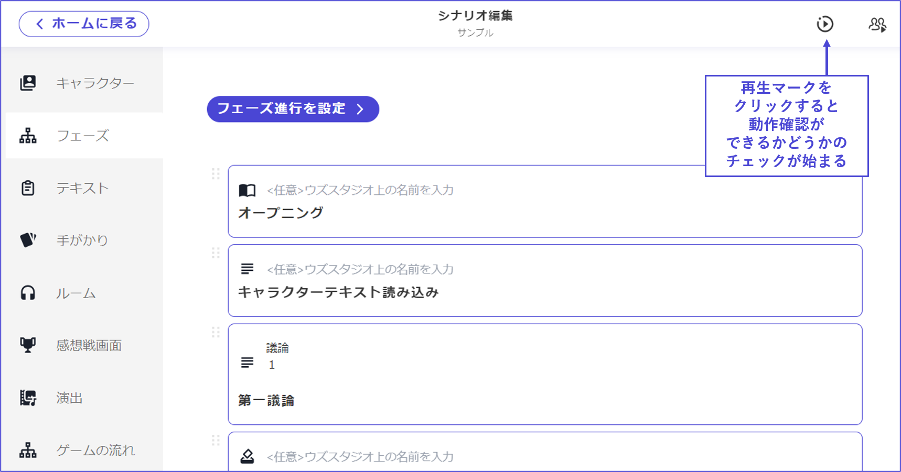
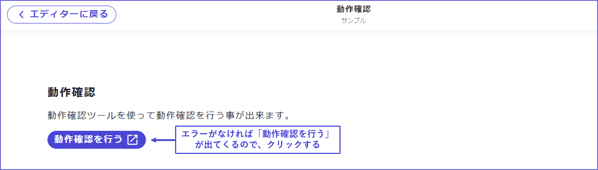

# 右上按鈕：動作確認

在實際的應用程式中進行測試遊玩之前，可以在UZU STUDIO上進行動作確認。

點擊編輯器畫面右上的「播放按鈕」，會自動檢查是否可以進行動作確認。

\

如果有設定遺漏，會顯示**未設定部分**，請適當修正。

點擊「**前往相關部分**」，可以直接跳到出錯的地方。

\

如果所有設定都完成，畫面會切換並顯示「**進行動作確認**」，請點擊。

\

在操作與應用程式幾乎相同的畫面時進行動作確認。

BGM和SE也會播放。

