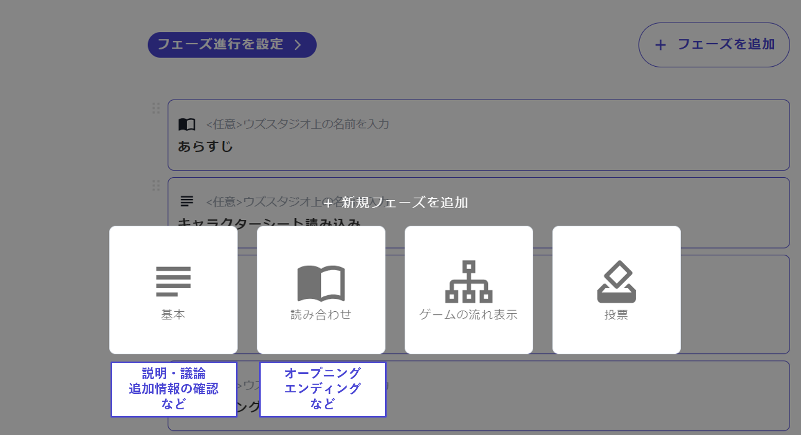

# 階段的創建・概述

說明如何創建階段。

首先，按下階段列表畫面右上角的「添加階段」。

\\

接著會出現一個畫面，讓您從以下四種階段類型中選擇。根據您想創建的階段內容，選擇適合的類型。

\\

各種階段類型的特徵如下。點擊類型名稱會跳轉到更詳細的說明頁面。

| 類型名稱                  | 可以做的事情        | 使用例                    |
| --------------------- | ------------- | ---------------------- |
| [基本](discussion.md)   | 顯示文字和圖片       | 角色文本讀取・討論・說明的提示・確認附加信息 |
| [閱讀對照](script.md)     | 顯示地文和台詞       | 開場・結尾・幕間               |
| [遊戲流程顯示](timeline.md) | 顯示遊戲整體流程和下一階段 | －                      |
| [投票](select.md)       | 顯示選項和投票       | 犯人投票・分支前的選擇・調查地點的選擇    |
