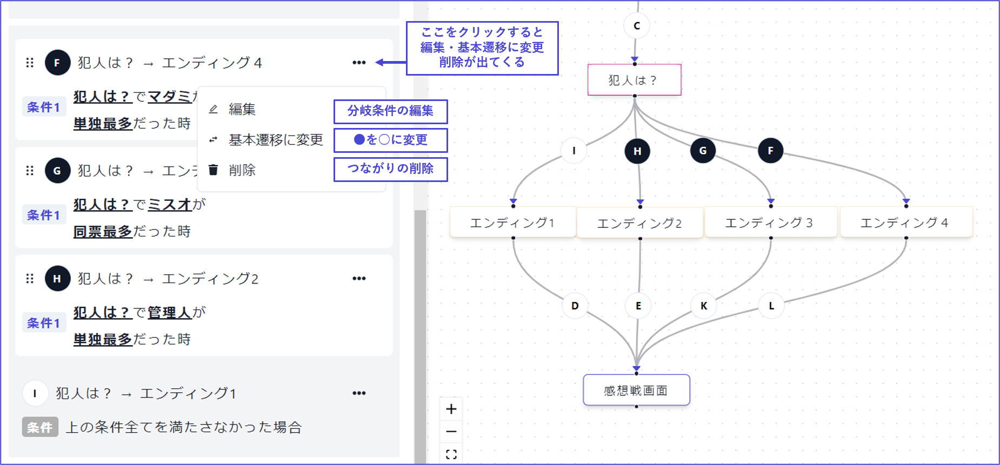

# 階段進行

階段進行是設定**階段之間的順序**和**分支**的畫面。

從左側菜單中選擇「階段」，然後點擊該畫面中的「進行設定」即可進入編輯畫面。

\

## 基本操作

基本的操作有「排列」和「連接」兩種。

階段與階段可以通過以下操作連接，您可以設定哪個階段之後接著哪個階段。線上寫的字母和左列顯示的字母是對應的。

如果想要將已經連接的線（遷移）重新連接到其他位置，請從左列中找到相應的字母，然後從「・・・」中選擇**刪除**。

※如果您使用智能手機瀏覽，請橫向持手機以顯示左半部分。

\

## 遷移的種類

階段與階段之間的線（遷移）有「**基本遷移**」和「**條件遷移**」兩種類型。

| 遷移的種類 | 外觀        | 說明                                                       |
| ----- | -------- | -------------------------------------------------------- |
| 基本遷移  | ○ 白底黑字   | 
點擊「下一步」/設定的時間經過後遷移 當不符合任何條件遷移時進行遷移
 |
| 條件遷移  | ● 黑底白字   | 僅在滿足條件時進行遷移                                        |

\

從一個階段設定多條線（遷移）時，必須有一條是「**基本遷移**」，其餘的是「**條件遷移**」。 想像從投票到結局的**分支**會更容易理解。

當有多個條件分支時，左列將**從上到下優先**。字母只是識別符號，與優先順序無關。

設定或刪除遷移條件時，請按「・・・」。

分支條件中也可以使用「且」和「或」的複合（嵌套）。詳情請參閱[這裡](../condition.md#gurpu)。

## 常見問題

關於階段進行的常見問題請參閱[這裡](../../QandA.md#phases)