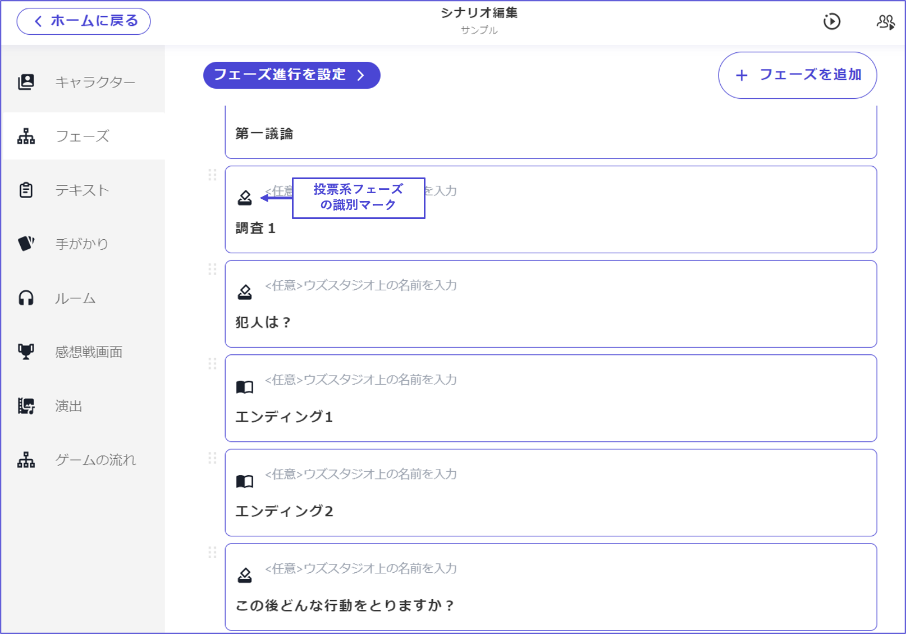

# 投票階段

在投票階段中，可以進行犯人投票等各種投票。在UZU STUDIO v2中，無論何處都可以多次設置投票階段。

\

下面說明投票階段的設定項目。

## 投票選項（基本）

設定選項的名稱和圖片。當有圖片和沒有圖片時的顯示差異如下所示。

關於階段完成條件

下一步按鈕：如果不選擇投票對象，將無法按下「下一步」。在投票階段中推薦使用此選項。

時間限制：即使未選擇投票對象，當設定的計時器歸零時也會進入下一步。在投票階段設置時間限制時請注意。

<figure><figcaption></figcaption></figure>

\

## 可以投票的角色

設定在該投票階段中可以投票的角色。在這裡設定特定角色後，只有該角色可以進行投票。適用於希望讓代表者一人進行投票的情況。

<figure><figcaption></figcaption></figure>

\

## 可以查看投票的角色

設定可以查看該投票階段投票內容的角色。在將此設定開啟的角色畫面中，會以圖標顯示誰投票給了哪個選項。適用於希望避免重複投票的情況。

<figure><figcaption></figcaption></figure>

\

## 是否在感想戰畫面顯示投票結果

投票結果是指在某個投票階段中，誰投票給了哪個選項，以及每個選項獲得了多少票的畫面。開啟此選項後，投票結果將顯示在感想戰畫面中，關閉則不顯示。

<figure><figcaption></figcaption></figure>

\

## 投票選項（應用）

可以為每個選項設置「顯示條件」和「選擇條件」。

「顯示條件」是指只有在滿足特定條件時，該選項才會出現的設定。當不滿足條件時，該選項將在所有角色的畫面中完全隱藏。與到達某個階段或擁有某個線索等條件相性良好。

<figure><figcaption></figcaption></figure>

\

「投票條件」是指只有在滿足特定條件或特定角色時，才能對該選項進行投票的設定。無法投票的選項將以淡色顯示。

<figure><figcaption></figcaption></figure>

\

也可以設置為無法讓兩人以上投票給同一選項。主要是針對希望結合投票和線索來創建調查階段的功能。想要更詳細了解調查階段的創建，請參考[此頁面](../../advanced/investigation.md)。

<figure><figcaption></figcaption></figure>

## 多票設定

可以設置讓一人持有多票，或只有滿足條件的人持有多票。

<figure><figcaption></figcaption></figure>