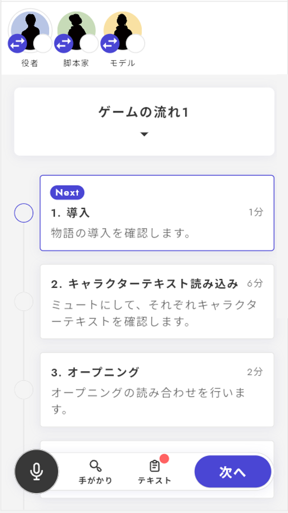

# 遊戲流程顯示階段

遊戲流程階段是指從開場、角色文本讀取、討論、進入投票、到結尾等**整個劇情的流程**。這個階段顯示玩家當前處於哪個階段，以及接下來將進入哪個階段。

在v1中，所有階段之間的遊戲流程會自動顯示，但在v2中，可以選擇在哪裡顯示。可以在不想中斷流程的階段之間繼續進行。

\\

遊戲流程階段可以從各個遊戲流程階段的詳細畫面中進行設定。

<figure><figcaption></figcaption></figure>

### 基本項目

基本項目包括「階段名稱」「階段的說明」「階段所需時間」。

分別如下顯示。

<figure><figcaption></figcaption></figure>

### 對應的階段（必須）

從時間線未設定階段中選擇對應於所創建遊戲流程的各個階段。

可以將**多個階段**設定為一個顯示。階段的排列順序可以更改，但排列順序並沒有特別的關係。

### 顯示條件（可選）

可以設定特定項目何時**不顯示**，以及何時開始顯示。

在某個結局通過時才會出現的秘密階段，或是在遊戲初期未揭示的額外討論等情況下有效。

對於開場、角色文本讀取、通常討論等不需要隱藏的階段，無需設定。

<figure><figcaption></figcaption></figure>