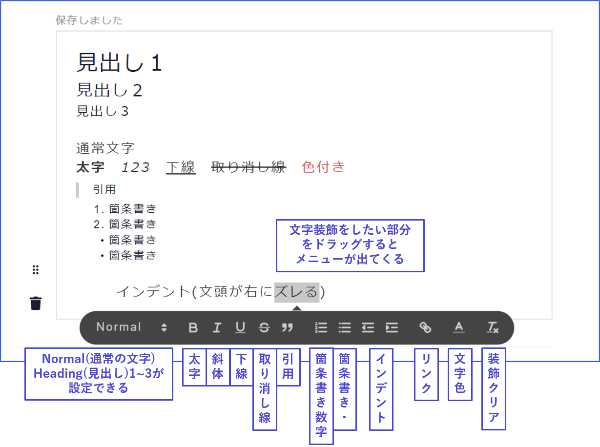
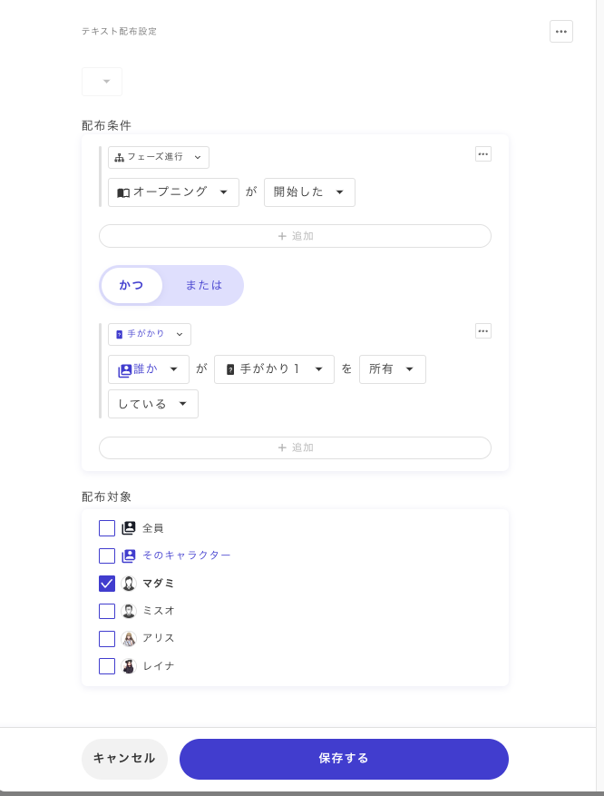
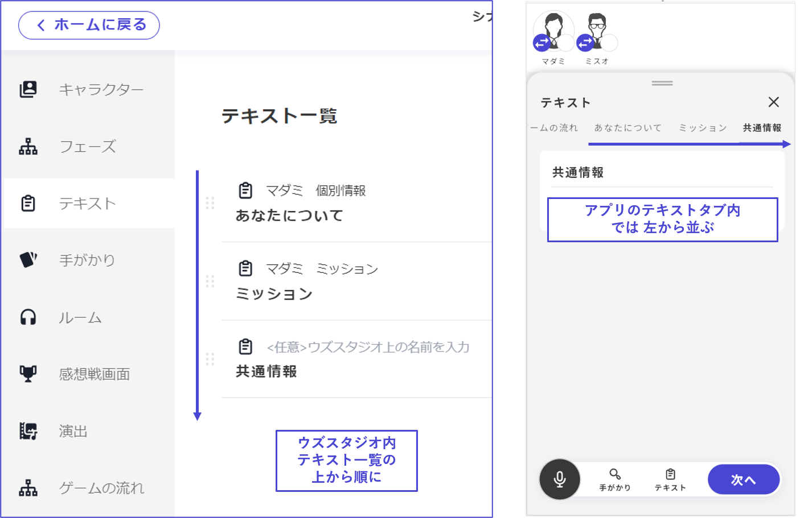

# 文本

## 文本

在文本中，可以設定和編輯在遊戲中分發到文本標籤的文本。

<figure><figcaption></figcaption></figure>

\\

### 新增文本

新增文本的方法有兩種。

\\

#### ①從文本列表中新增

點擊文本列表畫面右上角的「**新增文本**」，即可創建「新文本標籤」。

點擊「新文本標籤」後，將進入內容編輯畫面。

<figure><figcaption></figcaption></figure>

\\

#### ②從想要分發的階段內新增

從階段編輯畫面右側的「分發物」部分進行新增。

按下分發物下方的「新增」按鈕後，可以選擇要新增哪種類型的分發物，選擇「文本」，設定文本名稱和詳細條件後，點擊「保存」。

<figure><figcaption></figcaption></figure>

此外，點擊畫面右下的「作為文本分發」，將會在該階段結束時分發與階段內容完全同步的文本。比如想要在階段結束時重新閱讀開場白等情況下使用。\\

### 文本標籤的內容

在文本標籤中，除了文本和圖片，還可以加入分隔線和對話框。

請從各自的新增按鈕中新增。之後也可以更改順序。

<figure><figcaption></figcaption></figure>

在文本中，可以使用以下的文字裝飾。

<figure><figcaption></figcaption></figure>

\\

在圖片中，可以設定圖片在畫面上的**對齊位置**（左對齊、居中、右對齊），以及顯示的**大小**。

<figure><figcaption></figcaption></figure>

除了「到達特定階段時」分發給「特定角色」的基本條件外，還可以設定**複雜的分發條件**。請在分發**特殊信息**或**附加信息**時加以利用。

<figure><figcaption></figcaption></figure>

也可以根據角色和條件控制文本或圖片的顯示與隱藏。詳情請參閱[此頁面](../advanced/text-customize.md)。\\

### 應用程式上的顯示順序

UZU STUDIO的文本列表中的**從上到下**的順序＝應用程式中文本標籤內的**從左到右**的順序。

請按照希望在應用程式上顯示的順序進行調整。

<figure><figcaption></figcaption></figure>
