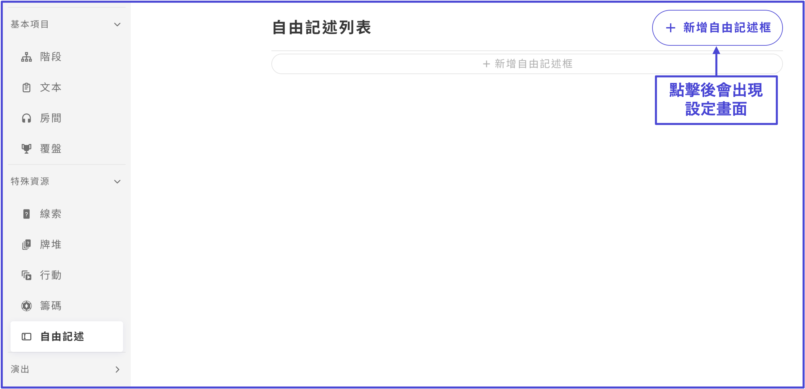
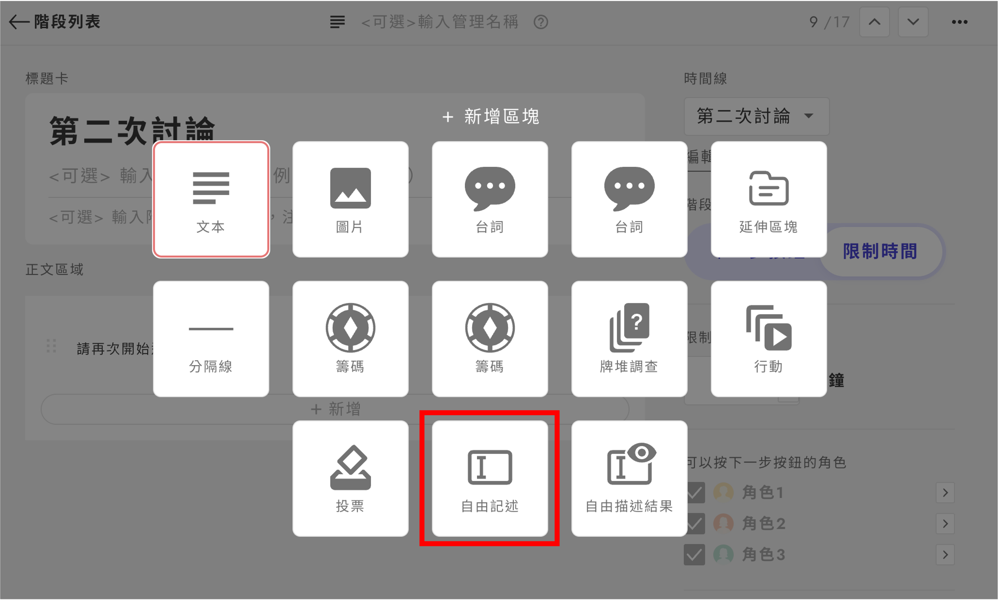
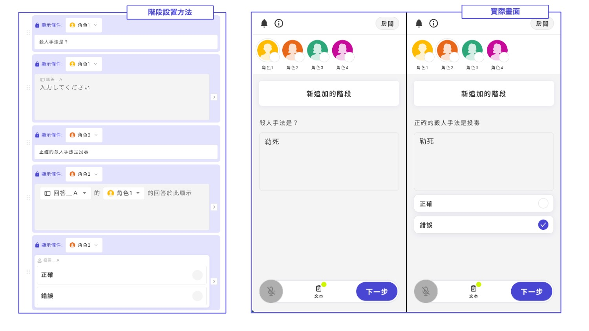
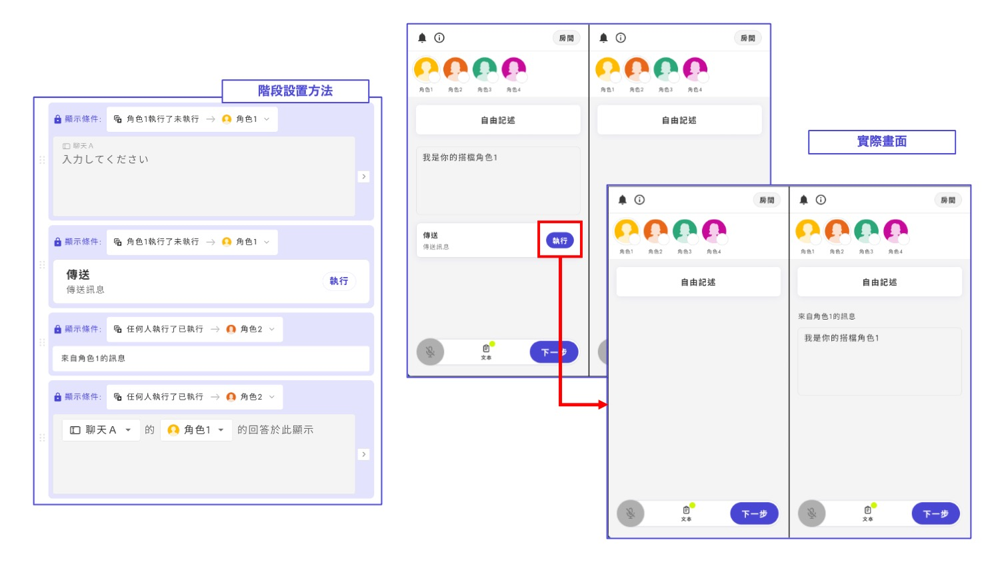
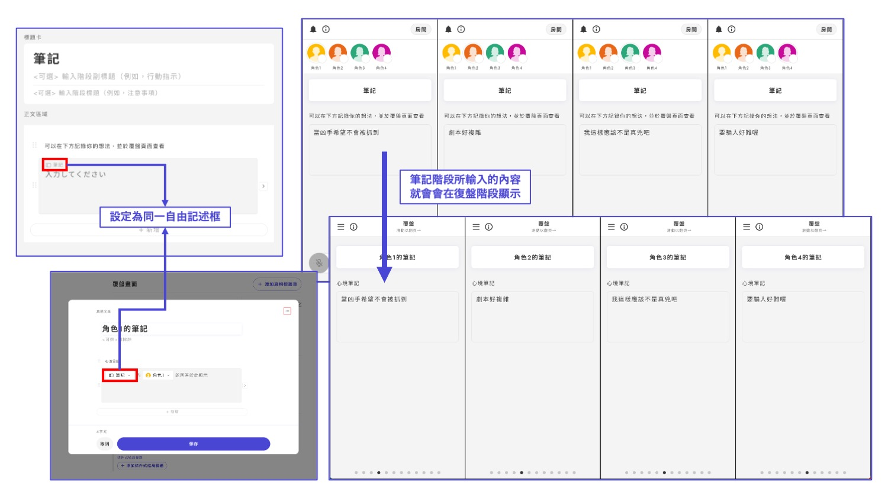

# 自由記述

## 建立自由記述框

如果自由記述未設置，畫面將顯示如下，請點擊「新增自由記述框」。

<figure><figcaption></figcaption></figure>

也可以直接從「階段」內新增並建立。

<figure><figcaption></figcaption></figure>

有兩種類型的自由記述

* 自由記述（輸入框）
* 自由記述結果

## 自由記述

玩家可以自由輸入內容，輸入的文字會立即反映在同一個自由記述框中。

<figure><figcaption></figcaption></figure>

新建時需設定管理名，玩家不會看到管理名。

<figure><figcaption></figcaption></figure>

## 自由記述結果

這是一個專門用於顯示先前自由記述內容的區塊，不能用於輸入。

新增後，可以根據管理名選擇對應的自由記述項目。&#x20;

<figure><figcaption></figcaption></figure>

## 應用

### 可用於開放式問題的的正確判定

不再只是讓玩家「從選項中選擇可能的犯罪方法」，而是可以讓玩家自行輸入認為犯罪方法 → 可以在下一個階段或復盤畫面中對答案，或是讓另一位玩家判斷結果。

<figure><figcaption></figcaption></figure>

### 可以像聊天一樣使用

例如，角色A輸入訊息後，透過行動按鈕將內容發送給角色B，角色B查看後可以回復訊息，實現類似聊天的互動。

<figure><figcaption></figcaption></figure>

### 用於記錄

在討論階段輸入的「內心筆記」（例如思路或心境）可以在復盤畫面中進行回顧與分享。

<figure><figcaption></figcaption></figure>
