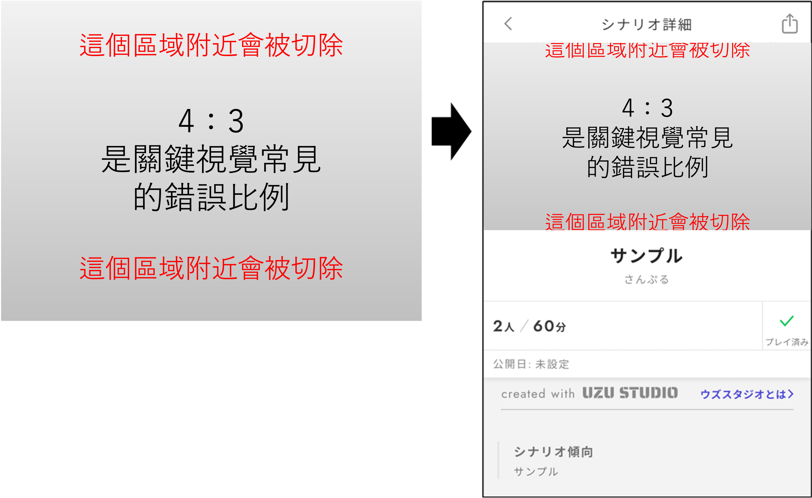
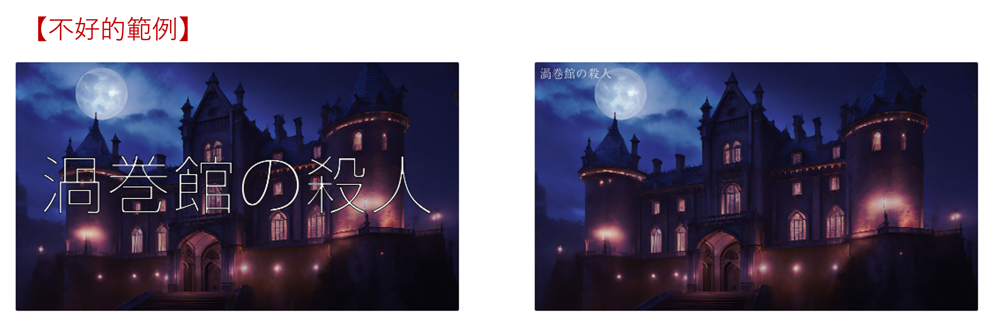
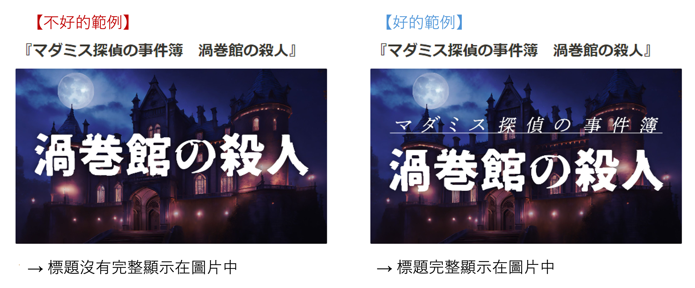

# 關鍵視覺創建規範

我們制定了關於從UZU STUDIO發布的劇本的關鍵視覺（封面圖片・標題圖片）的規範。

## ① 圖片的縱橫比需製作為16:9

非16:9製作的關鍵視覺將無法在應用程式內正確顯示。

<figure><figcaption></figcaption></figure>

<figure><figcaption></figcaption></figure>

## ② 標題需有易於閱讀的對比度

如果背景圖片和標題文字的顏色對比度較弱，可讀性將下降，請注意對比度來製作。


『對比度』是指在關鍵視覺中，明度・彩度・色相的差異。


<figure><figcaption></figcaption></figure>

### 改善方法

▷調整文字顏色

▷用線條勾勒標題文字

▷在標題文字的背景添加陰影

▷在背景圖片上覆蓋一層半透明的黑色或白色


**【進階注意事項】**

上述的【不良示例】【良好示例】中，通過調整「明度」「色相」來提高可讀性，但有一個需要注意的點。

那就是「**光暈效應**」。

光暈效應是指當配色的「明度」接近且「彩度」較高時，會導致眼睛刺痛的狀態。這會造成非常差的視覺設計，因此理想情況下應避免這種狀態。


## ③ 即使縮小尺寸，標題也易於閱讀

<figure><figcaption></figcaption></figure>

### 改善方法

▷增加字體的粗細

▷放大字體大小


在UZU應用程式的劇本列表畫面上顯示為「160px ✕ 90px」。可以將製作的關鍵視覺縮小，並確縮小時的視覺效果。


## ④ 顯示在劇本詳細中的標題需完整顯示在圖片中

<figure><figcaption></figcaption></figure>

如果要加入標題以外的文字，請確保標題文字的字體大小最為顯眼。

## ⑤ 使用的素材沒有侵犯版權・肖像權


**什麼是版權？**（簡單說明）

是指創作「著作物」的人所擁有的權利，防止其創作的著作物被無端複製或在網路上使用。

在關鍵視覺中，未經權利人許可使用插圖或圖片素材可能侵害版權，請注意。



**什麼是肖像權？**（簡單說明）

是指保護具有客戶吸引力的名人的姓名・肖像等的權利。

未經許可使用名人或著名人物的照片屬於侵犯肖像權，請注意。


***

※如有特殊情況希望採用不符合上述規範的關鍵視覺，請在審核時附上理由。
