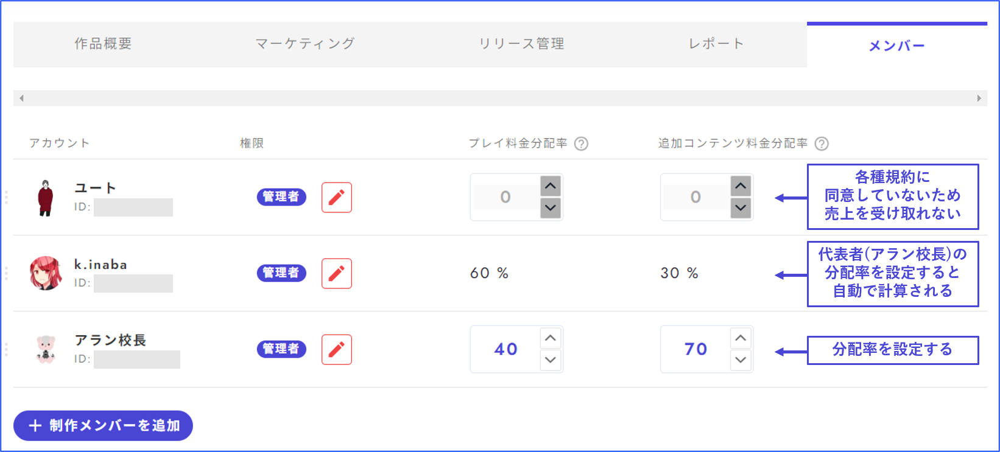

# 成員

在成員管理畫面中，可以新增共同創作者、閱覽者，並設定銷售分配率。

<figure><figcaption></figcaption></figure>

\

## 新增成員

① 按下「新增製作成員」按鈕。

② 輸入想要新增成員的UZU的用戶ID。正確輸入後會出現圖示，點擊該圖示。

③ 設定權限。

<figure><figcaption></figcaption></figure>

## 作為作家顯示

在應用程式內顯示為作家的設定不是在「成員」畫面中進行，而是在「作品概要」中進行。

在「作品概要」的作家欄中輸入**作家名**（不是玩家名），並設定頭銜。應用程式內的顯示範例如右圖所示。

※確認作家名的方法\
如果曾經製作作品並創建過最新版本，應用程式內的側邊菜單中會出現「作家頁面」按鈕（前提是使用相同帳號登入應用程式和UZU STUDIO）。按下作家頁面按鈕即可確認自己的作家名。

<figure><figcaption></figcaption></figure>

## 遊玩費用分配率

這是設定版稅在成員內的分配率。如果沒有多個人接收銷售收入，則不需要從顯示為100%的狀態進行更改。

更改後，新的比率將從次月\*開始適用。未同意「UZU STUDIO有償公開規約」的成員無法分配。[同意規約](author.md#heno)可從製作劇本列表畫面的右上角圖示進行。

## 附加內容分配率

這是設定附加內容銷售分配率的設定。如果沒有多個人接收銷售收入，則不需要從顯示為100%的狀態進行更改。

更改後，新的比率將從次月\*開始適用。未同意「UZU附加內容有償公開規約」的成員無法設定分配。[同意規約](author.md#heno)可從製作劇本列表畫面的右上角圖示進行。

#### \*關於次月的解釋

在UZU分析中，從該月初到月底的銷售收入會在次月顯示為統計，並可在次月以後申請匯款。如果在某個月的銷售發生期間設定了分配率，則從該月的銷售收入可以申請匯款的次月開始，分配率將被反映。

例

* 4/1發佈付費作品，4/2設定分配率 → 4月的銷售收入可以在5月以後申請匯款，並適用4/2設定的分配率。
* 4/1已設定分配率，4/2發佈付費作品 → 4月的銷售收入可以在5月以後申請匯款，並適用4/1設定的分配率。
* 3/31已設定分配率，4/1發佈付費作品 → 3月尚未發佈，沒有銷售收入，因此無關。4月的銷售收入可以在5月以後申請匯款，並適用3/31設定的分配率。
* 4/1發佈付費作品，但忘記設定分配率，5/1才設定 → 4月的銷售收入可以在5月以後申請匯款，但4月的銷售收入不適用分配率（支付給1名代表者）。5月的銷售收入可以在6月以後申請匯款，並適用分配率。

也就是說，必須在**發佈前**或**發佈的月份內**設定分配率。**如果未能在設定的情況下跨月，則無法處理**，請預先知悉。

<figure><figcaption></figcaption></figure>

## 同意規約

請從製作劇本列表畫面的右上角圖示進行同意規約。所有接收銷售收入的人都必須同意規約。

<figure><figcaption></figcaption></figure>

