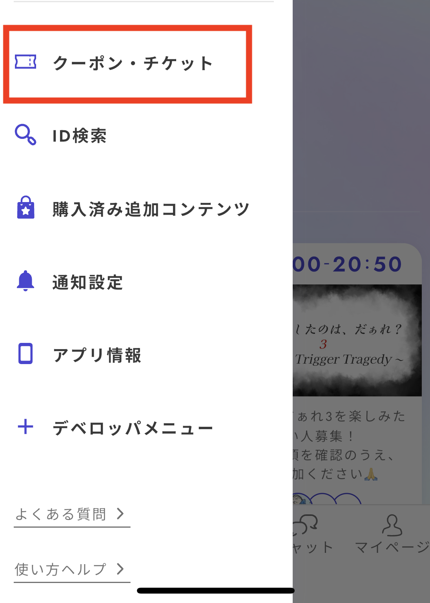

# 行銷

這是一個可以創建和管理附加內容以及發行票券代碼的畫面。

## 附加內容的創建與管理

### 基本設定

可以創建在劇情遊玩後可購買的內容，如後日談或製作秘話等。

<figure><figcaption></figcaption></figure>

附加內容的價格下限為0硬幣，上限則無限制。

可以上傳的內容類型如下：

* 圖片(png/jpg格式)
* 影片(mp4格式)
* 音訊(mp3格式)
* pdf
* 在UZU STUDIO內可創建的文字編輯器

### 同意條款

若要付費公開，請閱讀「UZU附加內容有償公開條款」。所有接受收益的人都必須同意條款，否則無法公開。

<figure><figcaption></figcaption></figure>

共創時的收益分配設定可在「成員」畫面中進行。

無法針對每種附加內容類型設置分配率，所有類型的分配率設定將統一進行。

<figure><figcaption></figcaption></figure>

### 在應用程式中的顯示

附加內容在應用程式端的顯示如下。可在更新至v3.50.0以上的裝置上確認。

<figure><figcaption></figcaption></figure>

<figure><figcaption></figcaption></figure>

<figure><figcaption></figcaption></figure>

## 票券代碼的發行

僅限於付費劇情，可以發行可兌換為免費體驗劇情的票券代碼。這是一個方便的功能，適合在希望他人遊玩並撰寫評論或舉辦活動時使用。

在進行付費作品的v2移行測試遊玩時，也可以用來讓人免費遊玩。

### 基本規範

* 發行的代碼只能使用一次。※如果用自己的帳號嘗試輸入，該票券將無法被其他人使用，請注意。
* 一次最多可發行劇情角色數×3件，每月1日恢復可發行數量。
* 使用票券免費遊玩的人不會計入銷售額。

### 發行方式

在劇情詳細畫面的「行銷」標籤中，點擊「新代碼發行」。

<figure><figcaption></figcaption></figure>

按下按鈕後，將顯示如下畫面，並發行代碼。將此代碼號碼告知希望遊玩劇情的人。請注意，每個代碼只能使用一次。

<figure><figcaption></figcaption></figure>

### 在應用程式中的使用方法

從側邊菜單中按下「優惠券・票券」。

<figure><figcaption></figcaption></figure>

輸入剛才發行的優惠券代碼後，「持有票券列表」中將增加相應劇情的免費票券。

<figure><figcaption></figcaption></figure>

票券兌換後，在UZU STUDIO中將顯示如下畫面，並可確認兌換的用戶。

<figure><figcaption></figcaption></figure>

### 面向用戶的使用方法說明頁面

面向用戶的使用方法說明頁面已公開。可將以下鏈接附加給票券接收者。

* [https://www.uzu-app.com/articles/free-play-ticket](https://www.uzu-app.com/articles/free-play-ticket)

### 關於隱性行銷的注意事項

隱性行銷是指實際上是廣告或宣傳，但隱藏這一事實來推銷產品或服務，從2023年10月起被規定為景品表示法上的不當表示。

應注意的例子

* 隱藏使用免費票券遊玩的事實，讓人撰寫高評價
* 隱藏接受宣傳委託後進行遊玩的事實，讓人進行宣傳

對策的例子

* 不強迫撰寫高評價或進行宣傳
* 在活動中遊玩或使用免費票券遊玩時，附上該事實後撰寫感想
* 在撰寫文章或感想時，明確標示為宣傳

詳情請搜索「隱性行銷」、「隱性行銷法」等。
