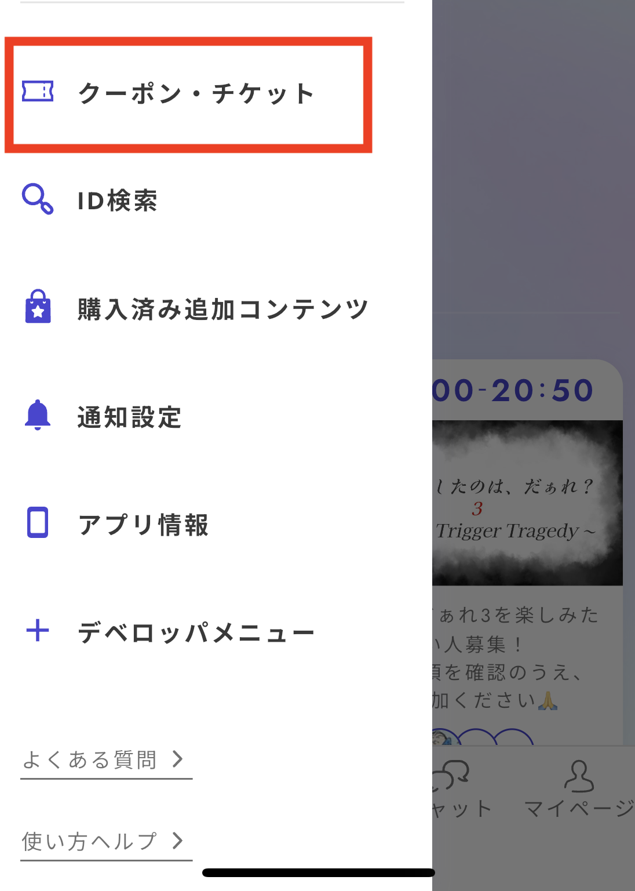
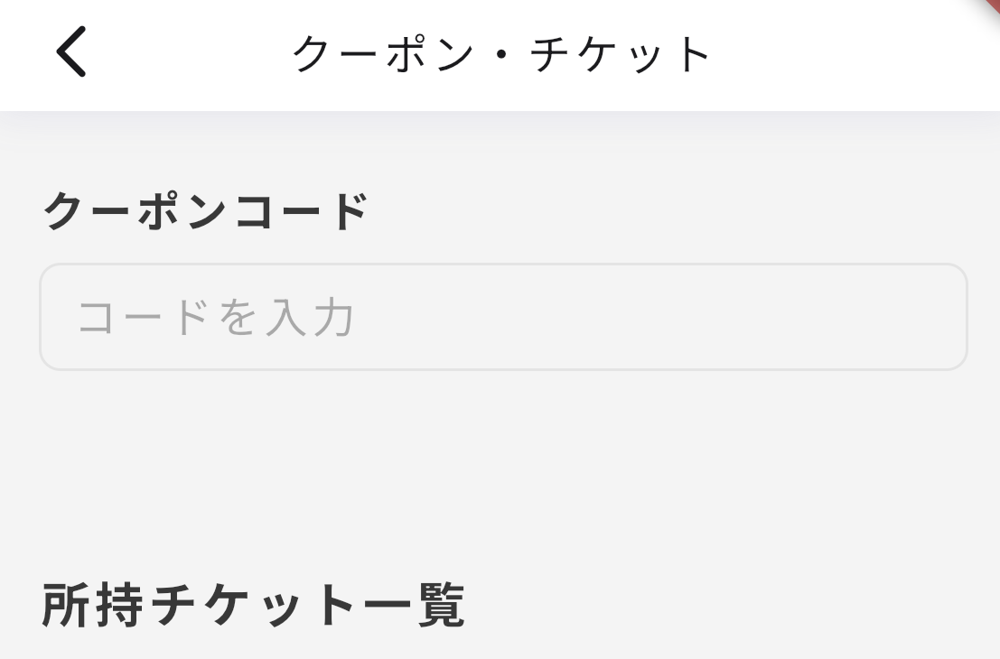

# マーケティング

追加コンテンツの作成・管理と、チケットコードの発行ができる画面です。

## 追加コンテンツの作成・管理

### 基本設定

後日談や制作秘話など、シナリオプレイ後に購入できるコンテンツを作成することができます。

<figure><figcaption></figcaption></figure>

追加コンテンツの値段の下限は0コイン、上限はありません。

アップロードできるコンテンツの種類は以下の通りです。

* 画像(png/jpg形式)
* 動画(mp4形式)
* 音声(mp3形式)
* pdf
* ウズスタジオ内で作成できるテキストエディタ

### 規約への同意

有料で公開する際は「ウズ追加コンテンツ有償公開規約」をご一読ください。売り上げを受け取る人全員が規約に同意していなければ公開できません。

<figure><figcaption></figcaption></figure>

共作の場合の売り上げの分配設定は「メンバー」画面から行います。

追加コンテンツの種類ごとに分配率を設定することはできず、全て一括での分配率設定になります。

<figure><figcaption></figcaption></figure>

### アプリ内での表示

追加コンテンツのアプリ側での見え方は以下のようになります。v3.50.0以上にアップデートしている端末で確認できます。

<figure><figcaption></figcaption></figure>

<figure><figcaption></figcaption></figure>

<figure><figcaption></figcaption></figure>

## チケットコードの発行

有料シナリオに限り、シナリオを無料で体験してもらえるチケットと引き換えることができるコードを発行することが出来ます。自分のシナリオをプレイしてレビューを書いてもらいたいときや、キャンペーンを行うときなどに便利な機能です。　

有料作品のv2移行テストプレイを実施する際に、無料で遊んでもらうためにも使えます。

### 基本仕様

* 発行したコードは一度ずつしか使えません。※試しに自分のアカウントで入力してみるなどすると、そのチケットは他の人が使えなくなるので注意してください。
* 一度にシナリオのキャラクター数×3件まで発行でき、毎月1日に発行可能数が回復します。
* チケットを使って無料でプレイした人の分の売上は入りません。

### 発行の仕方

シナリオ詳細画面の「マーケティング」タブに遷移して、「新規コード発行」をタップします。

<figure><figcaption></figcaption></figure>

ボタンを押すと以下のような画面となり、コードが発行されます。このコード番号をシナリオをプレイしてもらいたい人に伝えます。コードは一つにつき一回しか使えないので注意してください。

<figure><figcaption></figcaption></figure>

### アプリでの適用の仕方

サイドメニューから「クーポン・チケット」を押します。

<figure><figcaption></figcaption></figure>

先ほど発行したクーポンコードを入力すると、「所持チケット一覧」に該当のシナリオの無料チケットが増えます。

<figure><figcaption></figcaption></figure>

チケットが換券されると、ウズスタジオでは以下のような画面になり、換券したユーザーがわかります。

<figure><figcaption></figcaption></figure>

### ユーザー向け　使用方法説明ページ

ユーザー向けの使用方法説明ページが公開されています。チケットを渡す相手に以下のリンクを添えて送るとよいでしょう。

* [https://www.uzu-app.com/articles/free-play-ticket](https://www.uzu-app.com/articles/free-play-ticket)

### ステルスマーケティングについての注意喚起

ステルスマーケティングとは、実際には広告や宣伝であるのにそれを隠して商品やサービスの販促・宣伝を行うことで、2023年10月より景品表示法上の不当表示として規制されています。

気をつけるべき例

* 無料チケットでプレイしたことを隠して高評価を書いてもらう
* 宣伝の依頼を受けてプレイしたことを隠して宣伝してもらう

対策の例

* 高評価や宣伝を強要しない
* キャンペーンで遊んだ、無料チケットで遊んだ旨を添えた上で感想投稿してもらう
* 記事や感想投稿時に宣伝であることを明記してもらう

詳しくは「ステルスマーケティング」、「ステマ法」等で検索してください。

