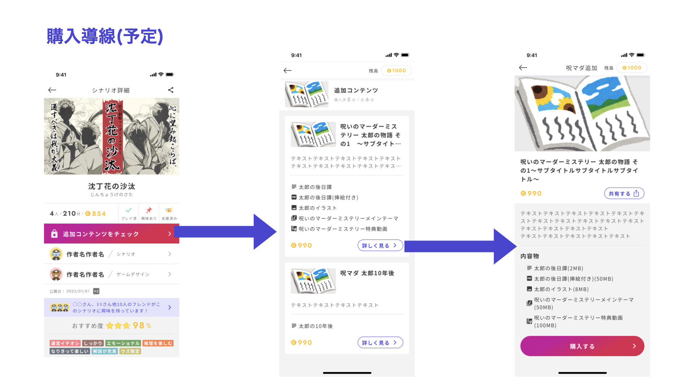
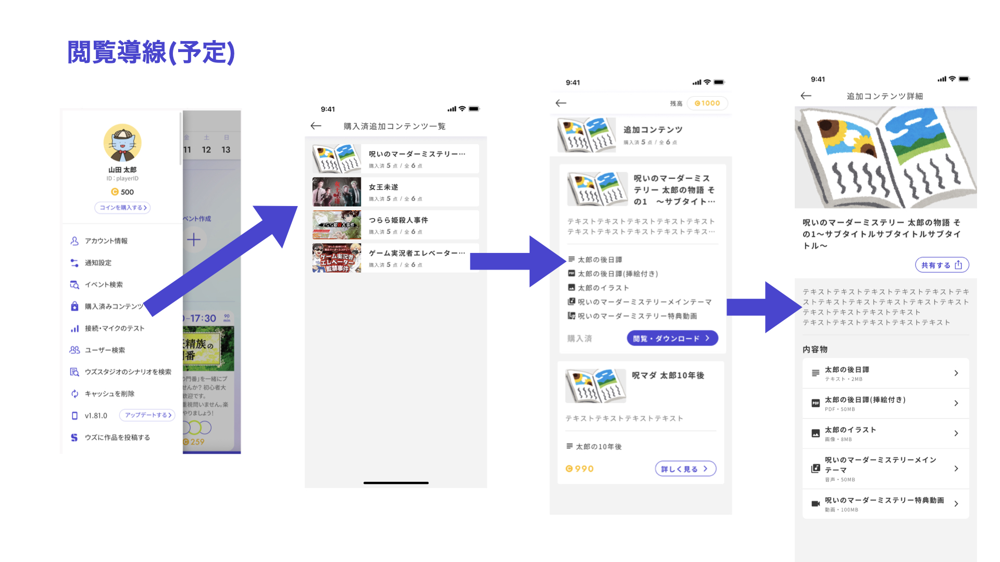

# マーケティング

追加コンテンツの作成・管理画面です。

後日談や制作秘話など、シナリオプレイ後に購入できるコンテンツを作成することができます。

<figure><figcaption></figcaption></figure>

追加コンテンツのアプリ側での見え方は以下のようになります。

<figure><figcaption></figcaption></figure>

<figure><figcaption></figcaption></figure>
