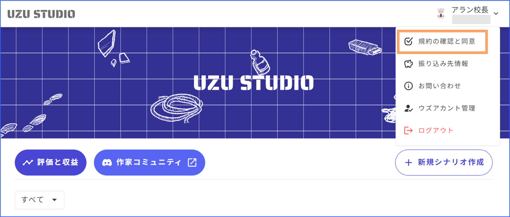

# マーケティング

追加コンテンツの作成・管理と、チケットコードの発行ができる画面です。

## 追加コンテンツの作成・管理

### 基本設定

後日談や制作秘話など、シナリオプレイ後に購入できるコンテンツを作成することができます。

<figure><figcaption></figcaption></figure>

追加コンテンツの値段の下限は0コイン、上限はありません。

アップロードできるコンテンツの種類は以下の通りです。

* 画像(png/jpg形式)
* 動画(mp4形式)
* 音声(mp3形式)
* pdf
* ウズスタジオ内で作成できるテキストエディタ

### 規約への同意

有料で公開する際は「ウズ追加コンテンツ有償公開規約」をご一読ください。売り上げを受け取る人全員が規約に同意していなければ公開できません。

<figure><figcaption></figcaption></figure>

共作の場合の売り上げの分配設定は「メンバー」画面から行います。

追加コンテンツの種類ごとに分配率を設定することはできず、全て一括での分配率設定になります。

<figure><figcaption></figcaption></figure>

### アプリ内での表示

追加コンテンツのアプリ側での見え方は以下のようになります。v3.50.0以上にアップデートしている端末で確認できます。

<figure><figcaption></figcaption></figure>

<figure><figcaption></figcaption></figure>

<figure><figcaption></figcaption></figure>

## チケットコードの発行

有料シナリオに限り、シナリオを無料で体験してもらえるチケットと引き換えることができるコードを発行することが出来ます。自分のシナリオをプレイしてもらって宣伝したい時や、キャンペーンを行う時などに便利な機能です。　

### 基本仕様

* 発行したコードは一度ずつしか使えません。
* 一度にシナリオのキャラクター数×3件まで発行でき、毎月1日に発行可能数が回復します。

### 発行の仕方

シナリオ詳細画面の「マーケティング」タブに遷移して、「新規コード発行」をタップします。

<figure><figcaption></figcaption></figure>

ボタンを押すと以下のような画面となり、コードが発行されます。このコード番号をシナリオをプレイして貰えたい人に伝えます。コードは一つにつき一回しか使えないので注意してください。

<figure><figcaption></figcaption></figure>

### アプリでの適用の仕方

サイドメニューから「クーポン・チケット」を押します。

<figure><figcaption></figcaption></figure>

先ほど発行したクーポンコードを入力すると、「所持チケット一覧」に該当のシナリオの無料チケットが増えます。

<figure><figcaption></figcaption></figure>

チケットが換券されると、ウズスタジオでは以下のような画面になり、換券したユーザーがわかります。

<figure><figcaption></figcaption></figure>
