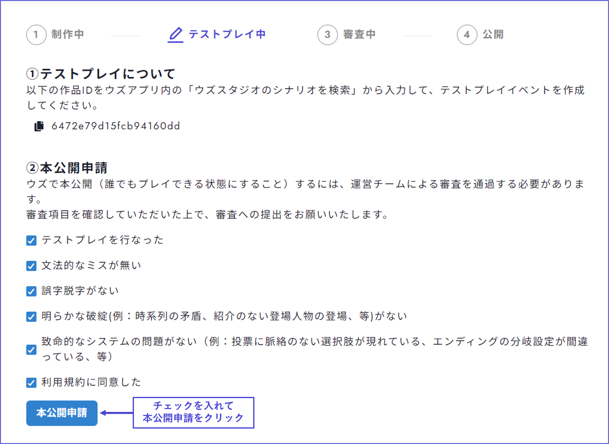

# リリース管理

「リリース管理」画面では、**バージョンの確認**、**審査提出**、**テストプレイ時に必要なIDのコピー**ができます。

## バージョンの確認

v2では「最新版」と「リリース版」という概念があります。 作品が審査を通過するまでは「最新版」のみとなっており、審査通過後に「リリース版」へ変更することができます。

アプリ上で作品を公開した後、ウズスタジオから誤植等の内容の修正を行った場合は、**最新バージョンの作成後、「最新版をリリース」を押し忘れないよう注意**してください。

<table><thead><tr><th width="142.33333333333331">名称</th><th>内容</th><th>バージョン</th></tr></thead><tbody><tr><td>最新版</td><td>「アプリに反映する」を押した最新内容。</td><td>作者が作成するイベントでのみ遊べる最新バージョンであり、テストプレイ版とも言える。</td></tr><tr><td>リリース版</td><td>「アプリに反映する」→「最新版をリリース」を押した内容。</td><td>アプリ上で一般ユーザーも遊べるバージョン。</td></tr></tbody></table>

<figure><figcaption></figcaption></figure>

#### 最新バージョンについてさらに詳しく

作者だけがイベント作成できるテストプレイ用であり、アプリ上の一般ユーザーはプレイできないバージョンのことです。

v2では、v1に比べて自由度が高くなった分、設定箇所や考慮する部分が多くなっており、実装ミスが発生しやすいと考えられます。ミスが残ったままのバージョンが公開されてしまわないよう、一度、最新バージョンが作成されるようになっています。最新バージョンは、バージョン管理画面で「最新版」と表示されます。

バージョン管理画面から「**最新版をリリース**」を押すと、一般ユーザーも遊べるバージョンとしてアプリ上にリリースされます。v1→v2移行作品では**移行申請が承認されるまで「最新版をリリース」は押せない**ようになっています。

## 審査提出

&#x20;確認事項を読み、チェックを入れて「**本公開申請**」ボタンを押すと、作品を審査に提出できます。

審査は、**無料**公開予定の作品に対する**簡易審査**と**有料**公開予定の作品に対する[**詳細審査**](../overview/makingflow/submit/check.md)に分かれています。 本公開申請ボタンを押した先の**フォーム**から、どちらの審査に提出するか選択し、必要事項を記入してください。

## 作品IDのコピー

ウズで一般公開されていないテストプレイ段階の作品をアプリで見るには、作品ID（英数字の文字列）が必要です。以下のような画面からコピーして使用してください。

テストプレイについては、[こちらのページ](../overview/makingflow/testplay.md)で説明しています。

<figure><figcaption></figcaption></figure>

